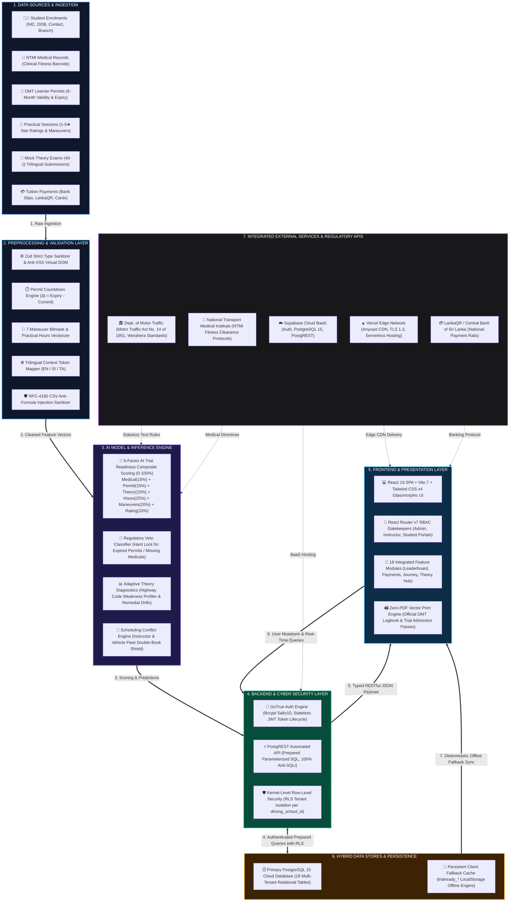
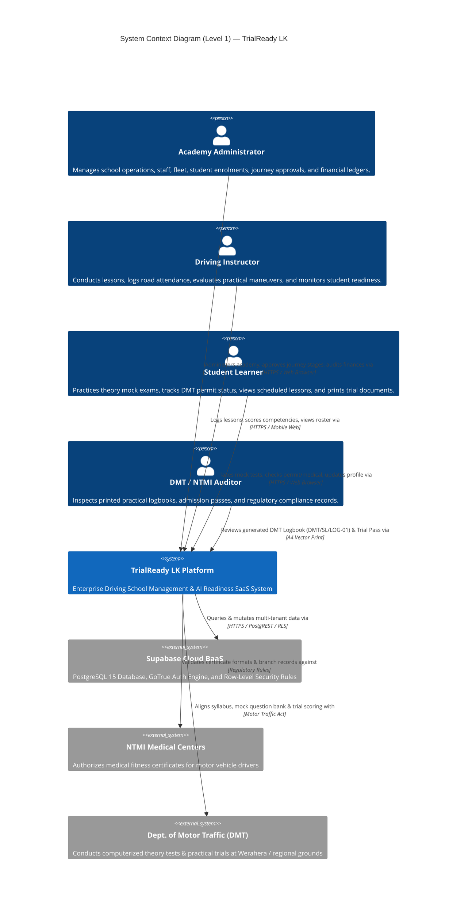
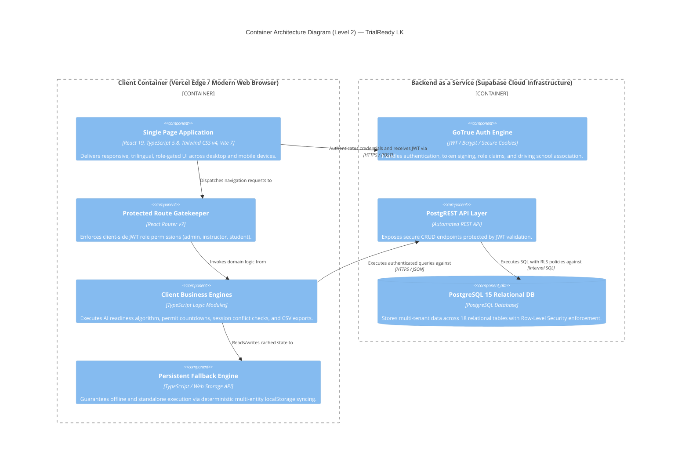
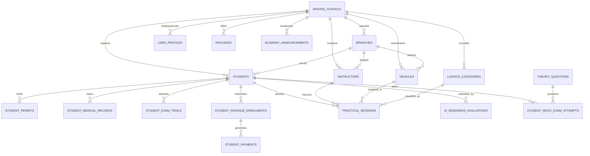
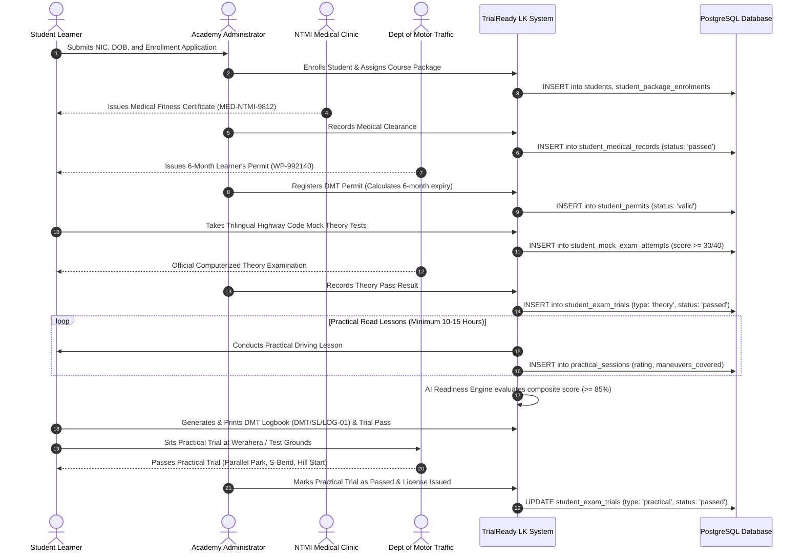
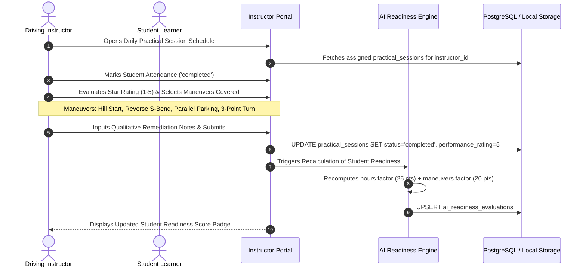
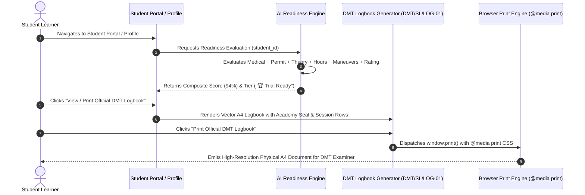

# System Architecture & Technical Specification — TrialReady LK

> **Project Name:** TrialReady LK — Sri Lankan Driving Academy Management & AI-Assisted DMT Trial Readiness System  
> **Academic Context:** BSc (Hons) in Cyber Security — Capstone Enterprise System  
> **Author & Lead Architect:** Ravishka Rathnayaka  
> **Document Version:** 2.0.0 (Production Release)  
> **Regulatory Standard:** Sri Lanka Motor Traffic Act No. 14 of 1951 & National Transport Medical Institute (NTMI) Directives  
> **Live Production Deployment:** [https://trial-ready-lk-pi.vercel.app](https://trial-ready-lk-pi.vercel.app)  

---

## Table of Contents

1. [Executive Summary & Architectural Principles](#1-executive-summary--architectural-principles)
2. [C4 Architectural Scheme & System Topology](#2-c4-architectural-scheme--system-topology)
   - [Level 1: System Context Diagram](#level-1-system-context-diagram)
   - [Level 2: Container Architecture Diagram](#level-2-container-architecture-diagram)
   - [Level 3: Component Architecture Diagram](#level-3-component-architecture-diagram)
3. [Full Database Schema & Relational Entity-Relationship Scheme](#3-full-database-schema--relational-entity-relationship-scheme)
   - [Entity Relationship Diagram (Mermaid)](#entity-relationship-diagram-erd)
   - [Comprehensive Data Dictionary (18 Tables)](#comprehensive-data-dictionary)
4. [Cyber Security, Defense-in-Depth & Compliance Architecture](#4-cyber-security-defense-in-depth--compliance-architecture)
   - [Zero-Trust Multi-Tenancy & Row-Level Security (RLS)](#zero-trust-multi-tenancy--row-level-security-rls)
   - [Role-Based Access Control (RBAC) Matrix](#role-based-access-control-rbac-matrix)
   - [Defensive Coding & Injection Countermeasures](#defensive-coding--injection-countermeasures)
   - [Cryptographic Hygiene & Session Management](#cryptographic-hygiene--session-management)
5. [Core Algorithms & Mathematical Formulations](#5-core-algorithms--mathematical-formulations)
   - [AI-Assisted Trial Readiness Composite Scoring Engine](#ai-assisted-trial-readiness-composite-scoring-engine)
   - [DMT Learner Permit Validity & Expiry Engine](#dmt-learner-permit-validity--expiry-engine)
   - [Session Conflict & Overlap Prevention Logic](#session-conflict--overlap-prevention-logic)
   - [Financial Ledger Balancing & Installment Calculation](#financial-ledger-balancing--installment-calculation)
6. [Frontend Feature Modules & Navigation Scheme](#6-frontend-feature-modules--navigation-scheme)
   - [Application Route Hierarchy & Access Matrix](#application-route-hierarchy--access-matrix)
   - [18 Core Subsystems & User Interface Schemes](#18-core-subsystems--user-interface-schemes)
7. [State Management & Dual-Mode Persistence Architecture](#7-state-management--dual-mode-persistence-architecture)
8. [Data Flow & Lifecycle Sequence Diagrams](#8-data-flow--lifecycle-sequence-diagrams)
   - [Sequence 1: Student Enrollment to DMT License Grant](#sequence-1-student-enrollment-to-dmt-license-grant)
   - [Sequence 2: Practical Session Evaluation & Competency Scoring](#sequence-2-practical-session-evaluation--competency-scoring)
   - [Sequence 3: AI Readiness Assessment & Official Document Printout](#sequence-3-ai-readiness-assessment--official-document-printout)
9. [Deployment, Infrastructure & CI/CD Topology](#9-deployment-infrastructure--cicd-topology)

---

## 1. Executive Summary & Architectural Principles

**TrialReady LK** is a specialized, multi-tenant cloud Software-as-a-Service (SaaS) platform tailored to the legal, operational, and regulatory workflows of driving schools in Sri Lanka. It unifies administrative business operations, instructor scheduling, vehicle telematics/compliance, student learner management, and Department of Motor Traffic (DMT) examination readiness.

```
┌────────────────────────────────────────────────────────────────────────────────────────┐
│                                   TRIALREADY LK                                        │
│             Sri Lankan Driving Academy Management & AI Trial Readiness Engine           │
├────────────────────────────────┬───────────────────────────┬───────────────────────────┤
│       OPERATIONAL LAYER        │     COMPLIANCE LAYER      │       AI / EDTECH         │
│  • Multi-branch Administration │  • NTMI Medical Tracking  │  • AI Readiness (0-100%)  │
│  • Instructor & Vehicle Fleet  │  • 6-Month DMT Permit Calc│  • Trilingual Theory Hub  │
│  • Session Calendar & Overlap  │  • 7-Stage Learner Journey│  • 40-Q Mock Exam Engine  │
│  • Package & Fee Invoicing     │  • Official DMT Logbook   │  • Maneuver Radar Metrics │
│  • Executive Analytics & CSV   │  • Trial Day Pass Slip    │  • Predictive Risk Blocker│
└────────────────────────────────┴───────────────────────────┴───────────────────────────┘
```

### Architectural Principles

1. **Zero-Trust Multi-Tenancy**: Strict tenant segregation at the database layer via PostgreSQL Row Level Security (RLS) policies anchored to the academy's `driving_school_id`.
2. **Offline-Resilient Dual-Mode Persistence**: Hybrid client architecture capable of operating against live Supabase PostgreSQL or a deterministic local storage fallback cache with zero degradation in user experience.
3. **Regulatory Fidelity**: Direct adherence to Sri Lankan Motor Traffic Act No. 14 of 1951, including NTMI medical certificate validity, 6-month DMT learner permit rules, 10-hour minimum practical instruction mandates, and official A4 paper layout standards (`DMT/SL/LOG-01` and `DMT/SL/ADM-PASS`).
4. **Browser-Native Vector Print Engine**: Elimination of heavy server-side PDF renderers in favor of CSS `@media print` layouts, ensuring zero binary PDF exploitation vectors and responsive vector rendering.
5. **Trilingual First-Class Citizenry**: Context-driven language switching across English, Sinhala (සිංහල), and Tamil (தமிழ்) with automatic schema fallbacks.

---

## 2. High-Level System Architecture (Presentation Slide 5)

> 📌 **Examiner & Judge Presentation Reference:** A dedicated slide and word-for-word viva narration script is available in [`docs/SLIDE_5_HIGH_LEVEL_ARCHITECTURE.md`](./SLIDE_5_HIGH_LEVEL_ARCHITECTURE.md).  
> 🖼️ **Direct High-Resolution Vector Graphic (SVG):** [`docs/assets/high_level_system_architecture_slide5.svg`](./assets/high_level_system_architecture_slide5.svg)

---

### 🎨 High-Resolution System Architecture Map


---

### 🧭 High-Level Data Flow Topology (Stage-by-Stage)



---

## 3. C4 Architectural Scheme & System Topology

### Level 1: System Context Diagram



---

### Level 2: Container Architecture Diagram



---

### Level 3: Component Architecture Diagram

```mermaid
graph TB
    subgraph "Frontend Presentation Layer (React 19 + Tailwind v4)"
        Layout[AppLayout / Header / Sidebar Navigation]
        AuthViews[Login & Demo Persona Selector]
        AdminViews[Admin Dashboard, Branches, Instructors, Fleet, Students, Financials, Analytics]
        InstructorViews[Instructor Portal, Practical Sessions, Competency Evaluation]
        StudentViews[Student Portal, Learner Journey, Profile & Security, DMT Documents]
        TheoryViews[Trilingual Theory Hub, 40-Q Timed Mock Exam, Flashcards]
        NotifViews[Notifications Center & Alert Broadcaster]
    end

    subgraph "Core Domain Business Engines"
        AI_Engine[AI Readiness Calculation Engine<br/>• 6 Weighted Factors<br/>• 0-100% Score<br/>• Critical Veto Blockers]
        Journey_Engine[7-Stage DMT Journey Pipeline<br/>• Permit Expiry Calc<br/>• Medical Verification<br/>• Stage Gatekeeper]
        Schedule_Engine[Session & Conflict Engine<br/>• Instructor/Vehicle Overlap<br/>• Attendance Status<br/>• Maneuver Matrix]
        Finance_Engine[Financial & Billing Ledger<br/>• Package Pricing<br/>• Installment Tracking<br/>• Receipt Generator]
        Print_Engine[Browser Vector Print Engine<br/>• DMT/SL/LOG-01 Logbook<br/>• DMT/SL/ADM-PASS Pass]
        Export_Engine[RFC-4180 Audit CSV Exporter<br/>• Formula Injection Sanitizer<br/>• UTF-8 Excel BOM]
        Lang_Engine[Trilingual Localization Engine<br/>• Sinhala, Tamil, English<br/>• Context Fallback]
    end

    subgraph "Data Access & Persistence Layer"
        AuthCtx[Auth Context & Session Provider]
        SupabaseClient[Supabase Client SDK / PostgREST Client]
        FallbackEngine[Persistent Storage Engine (localStorage + Schema Sync)]
    end

    Layout --> AuthViews & AdminViews & InstructorViews & StudentViews & TheoryViews & NotifViews
    AdminViews & StudentViews --> AI_Engine
    AdminViews & InstructorViews & StudentViews --> Journey_Engine
    AdminViews & InstructorViews --> Schedule_Engine
    AdminViews & StudentViews --> Finance_Engine
    StudentViews & AdminViews --> Print_Engine
    AdminViews --> Export_Engine
    TheoryViews --> Lang_Engine

    AI_Engine & Journey_Engine & Schedule_Engine & Finance_Engine --> SupabaseClient
    AI_Engine & Journey_Engine & Schedule_Engine & Finance_Engine --> FallbackEngine
    AuthViews --> AuthCtx
    AuthCtx --> SupabaseClient
```

---

## 3. Full Database Schema & Relational Entity-Relationship Scheme

### Entity Relationship Diagram (ERD)



---

### Comprehensive Data Dictionary

The TrialReady LK relational database consists of **18 domain tables** engineered for PostgreSQL 15:

#### 1. `driving_schools` (Tenancy Root)
| Column | Type | Constraints | Description |
| :--- | :--- | :--- | :--- |
| `id` | `UUID` | `PRIMARY KEY, DEFAULT gen_random_uuid()` | Unique Driving Academy ID |
| `name` | `VARCHAR(255)` | `NOT NULL` | Registered Academy Name (e.g. Royal Driving Academy) |
| `registration_number` | `VARCHAR(100)` | `UNIQUE, NOT NULL` | DMT Official Registration Code (e.g. DS-WP-2026-0042) |
| `email` | `VARCHAR(255)` | `NOT NULL` | Academy Administrative Contact Email |
| `phone` | `VARCHAR(50)` | `NOT NULL` | Academy Official Telephone |
| `address` | `TEXT` | `NOT NULL` | Academy Registered Headquarters Address |
| `is_active` | `BOOLEAN` | `DEFAULT true` | Tenancy Activation Status |
| `created_at` | `TIMESTAMPTZ` | `DEFAULT now()` | Record Creation Timestamp |

#### 2. `branches`
| Column | Type | Constraints | Description |
| :--- | :--- | :--- | :--- |
| `id` | `UUID` | `PRIMARY KEY, DEFAULT gen_random_uuid()` | Branch Identifier |
| `driving_school_id` | `UUID` | `REFERENCES driving_schools(id) ON DELETE CASCADE` | Parent Academy Tenant ID |
| `name` | `VARCHAR(255)` | `NOT NULL` | Branch Location Name (e.g. Colombo Central, Kandy City) |
| `phone` | `VARCHAR(50)` | `NULLABLE` | Branch Contact Number |
| `address` | `TEXT` | `NOT NULL` | Physical Branch Office Address |
| `is_active` | `BOOLEAN` | `DEFAULT true` | Branch Operational State |

#### 3. `user_profiles`
| Column | Type | Constraints | Description |
| :--- | :--- | :--- | :--- |
| `id` | `UUID` | `PRIMARY KEY` (Matches `auth.users.id`) | Supabase User Identity ID |
| `driving_school_id` | `UUID` | `REFERENCES driving_schools(id)` | Associated Academy Tenant |
| `role` | `VARCHAR(50)` | `CHECK (role IN ('administrator', 'instructor', 'student'))` | Role-Based Authorization Tier |
| `full_name` | `VARCHAR(255)` | `NOT NULL` | User Legal Full Name |
| `email` | `VARCHAR(255)` | `NOT NULL` | System Login Email |
| `phone` | `VARCHAR(50)` | `NULLABLE` | Mobile Phone Number |
| `avatar_url` | `TEXT` | `NULLABLE` | Profile Image URI |

#### 4. `instructors`
| Column | Type | Constraints | Description |
| :--- | :--- | :--- | :--- |
| `id` | `UUID` | `PRIMARY KEY, DEFAULT gen_random_uuid()` | Instructor Staff ID |
| `driving_school_id` | `UUID` | `REFERENCES driving_schools(id)` | Academy Tenant ID |
| `branch_id` | `UUID` | `REFERENCES branches(id)` | Primary Branch Assignment |
| `employee_code` | `VARCHAR(50)` | `NOT NULL` | Staff ID Code (e.g. INS-WP-001) |
| `full_name` | `VARCHAR(255)` | `NOT NULL` | Instructor Full Name |
| `nic` | `VARCHAR(20)` | `NOT NULL` | National Identity Card Number |
| `phone` | `VARCHAR(50)` | `NOT NULL` | Direct Mobile Number |
| `email` | `VARCHAR(255)` | `NULLABLE` | Staff Work Email |
| `is_active` | `BOOLEAN` | `DEFAULT true` | Instructor Active Duty Status |

#### 5. `vehicles`
| Column | Type | Constraints | Description |
| :--- | :--- | :--- | :--- |
| `id` | `UUID` | `PRIMARY KEY, DEFAULT gen_random_uuid()` | Vehicle Fleet ID |
| `driving_school_id` | `UUID` | `REFERENCES driving_schools(id)` | Academy Tenant ID |
| `branch_id` | `UUID` | `REFERENCES branches(id)` | Assigned Branch Depot |
| `registration_number` | `VARCHAR(50)` | `NOT NULL` | Sri Lankan Vehicle License Plate (e.g. WP-CAB-1234) |
| `make` | `VARCHAR(100)` | `NOT NULL` | Vehicle Brand (e.g. Toyota, Suzuki, Honda) |
| `model` | `VARCHAR(100)` | `NOT NULL` | Vehicle Model (e.g. Vitz Dual-Control, Alto K10) |
| `manufacture_year` | `INTEGER` | `NOT NULL` | Year of Manufacture |
| `transmission_type` | `VARCHAR(50)` | `CHECK (transmission_type IN ('manual', 'auto', 'both'))` | Dual-control transmission type |
| `fuel_type` | `VARCHAR(50)` | `CHECK (fuel_type IN ('petrol', 'diesel', 'electric', 'hybrid'))` | Fuel Subsystem |
| `revenue_licence_expiry` | `DATE` | `NOT NULL` | DMT Revenue License Expiry Date |
| `insurance_expiry` | `DATE` | `NOT NULL` | Commercial Driving Training Insurance Expiry |
| `emission_test_expiry`| `DATE` | `NOT NULL` | Eco-Test Compliance Expiry |
| `is_active` | `BOOLEAN` | `DEFAULT true` | Fleet Service Availability Status |

#### 6. `licence_categories`
| Column | Type | Constraints | Description |
| :--- | :--- | :--- | :--- |
| `id` | `UUID` | `PRIMARY KEY, DEFAULT gen_random_uuid()` | Category ID |
| `driving_school_id` | `UUID` | `REFERENCES driving_schools(id)` | Academy Tenant ID |
| `code` | `VARCHAR(10)` | `NOT NULL` | Sri Lanka DMT Code (`A`, `B`, `B1`, `C`, `G1`) |
| `name` | `VARCHAR(255)` | `NOT NULL` | Category Full Title (e.g. Light Motor Car Dual) |
| `description` | `TEXT` | `NULLABLE` | Regulatory Vehicle Class Specifications |
| `is_active` | `BOOLEAN` | `DEFAULT true` | Category Accreditation State |

#### 7. `packages` (Course Packages)
| Column | Type | Constraints | Description |
| :--- | :--- | :--- | :--- |
| `id` | `UUID` | `PRIMARY KEY, DEFAULT gen_random_uuid()` | Course Package ID |
| `driving_school_id` | `UUID` | `REFERENCES driving_schools(id)` | Academy Tenant ID |
| `name` | `VARCHAR(255)` | `NOT NULL` | Package Name (e.g. Dual Combo Car + Bike) |
| `total_fee` | `NUMERIC(12,2)` | `NOT NULL, CHECK (total_fee >= 0)` | Total Tuition Package Fee (LKR) |
| `practical_hours` | `INTEGER` | `NOT NULL, DEFAULT 15` | Minimum Mandated Practical Lessons |
| `is_active` | `BOOLEAN` | `DEFAULT true` | Package Enrollment Availability |

#### 8. `students`
| Column | Type | Constraints | Description |
| :--- | :--- | :--- | :--- |
| `id` | `UUID` | `PRIMARY KEY, DEFAULT gen_random_uuid()` | Candidate Student ID |
| `driving_school_id` | `UUID` | `REFERENCES driving_schools(id)` | Academy Tenant ID |
| `branch_id` | `UUID` | `REFERENCES branches(id)` | Enrolled Campus Branch |
| `admission_number` | `VARCHAR(50)` | `NOT NULL` | Student Serial Number (e.g. STU-2026-0089) |
| `full_name` | `VARCHAR(255)` | `NOT NULL` | Student Full Legal Name |
| `nic` | `VARCHAR(20)` | `NOT NULL` | Sri Lankan NIC (Old 9-digit+V / New 12-digit) |
| `date_of_birth` | `DATE` | `NOT NULL` | Date of Birth (Age $\ge 18$) |
| `phone` | `VARCHAR(50)` | `NOT NULL` | Mobile Contact Number |
| `email` | `VARCHAR(255)` | `NULLABLE` | Student Personal Email Address |
| `address` | `TEXT` | `NOT NULL` | Permanent Residential Address |
| `emergency_contact_name`| `VARCHAR(255)` | `NULLABLE` | Emergency Contact Guardian |
| `emergency_contact_phone`| `VARCHAR(50)`| `NULLABLE` | Guardian Emergency Contact Phone |
| `enrolment_date` | `DATE` | `NOT NULL, DEFAULT CURRENT_DATE` | Initial Enrollment Date |
| `is_active` | `BOOLEAN` | `DEFAULT true` | Current Active Learner Status |

#### 9. `student_permits`
| Column | Type | Constraints | Description |
| :--- | :--- | :--- | :--- |
| `id` | `UUID` | `PRIMARY KEY, DEFAULT gen_random_uuid()` | Permit Record ID |
| `student_id` | `UUID` | `REFERENCES students(id) ON DELETE CASCADE` | Student Learner Foreign Key |
| `permit_number` | `VARCHAR(50)` | `NOT NULL` | Official DMT Permit No (e.g. WP-992140) |
| `issued_date` | `DATE` | `NOT NULL` | DMT Issuance Date |
| `expiry_date` | `DATE` | `NOT NULL` | DMT Expiry Date (Issued Date + 6 Months) |
| `status` | `VARCHAR(50)` | `CHECK (status IN ('valid', 'expiring_soon', 'expired', 'renewed'))` | Real-time Validity Status |

#### 10. `student_medical_records` (NTMI Medicals)
| Column | Type | Constraints | Description |
| :--- | :--- | :--- | :--- |
| `id` | `UUID` | `PRIMARY KEY, DEFAULT gen_random_uuid()` | Medical Record ID |
| `student_id` | `UUID` | `REFERENCES students(id) ON DELETE CASCADE` | Student Learner Foreign Key |
| `certificate_number` | `VARCHAR(100)` | `NOT NULL` | NTMI Barcode Certificate No (e.g. MED-NTMI-9812) |
| `examination_date` | `DATE` | `NOT NULL` | Clinical Checkup Date |
| `status` | `VARCHAR(50)` | `CHECK (status IN ('passed', 'failed', 'conditional', 'pending'))` | NTMI Medical Fitness State |
| `ntmi_branch` | `VARCHAR(100)` | `NOT NULL` | NTMI Clinic Location (e.g. Werahera, Nugegoda) |

#### 11. `student_exam_trials` (DMT Theory & Practical Trials)
| Column | Type | Constraints | Description |
| :--- | :--- | :--- | :--- |
| `id` | `UUID` | `PRIMARY KEY, DEFAULT gen_random_uuid()` | Exam Trial ID |
| `student_id` | `UUID` | `REFERENCES students(id) ON DELETE CASCADE` | Student Learner Foreign Key |
| `exam_type` | `VARCHAR(50)` | `CHECK (exam_type IN ('theory', 'practical'))` | Examination Classification |
| `attempt_number` | `INTEGER` | `NOT NULL, DEFAULT 1` | DMT Official Attempt Counter |
| `scheduled_date` | `DATE` | `NOT NULL` | Official DMT Appointment Date |
| `status` | `VARCHAR(50)` | `CHECK (status IN ('scheduled', 'passed', 'failed', 'absent'))` | Official DMT Result |
| `score` | `NUMERIC(5,2)` | `NULLABLE` | Score for Theory (e.g. 92.00%) |

#### 12. `student_package_enrolments`
| Column | Type | Constraints | Description |
| :--- | :--- | :--- | :--- |
| `id` | `UUID` | `PRIMARY KEY, DEFAULT gen_random_uuid()` | Enrollment Subscription ID |
| `student_id` | `UUID` | `REFERENCES students(id) ON DELETE CASCADE` | Student Learner Foreign Key |
| `package_id` | `UUID` | `REFERENCES packages(id)` | Enrolled Package Identifier |
| `total_fee` | `NUMERIC(12,2)` | `NOT NULL` | Agreed Total Tuition Amount (LKR) |
| `discount_amount`| `NUMERIC(12,2)` | `DEFAULT 0.00` | Approved Scholarship / Promo Discount |
| `enrolment_date` | `DATE` | `DEFAULT CURRENT_DATE` | Date of Package Contract |

#### 13. `student_payments`
| Column | Type | Constraints | Description |
| :--- | :--- | :--- | :--- |
| `id` | `UUID` | `PRIMARY KEY, DEFAULT gen_random_uuid()` | Payment Transaction ID |
| `enrolment_id` | `UUID` | `REFERENCES student_package_enrolments(id)` | Subscription Ledger ID |
| `receipt_number` | `VARCHAR(50)` | `NOT NULL` | Official Voucher Number (e.g. RCT-2026-0042) |
| `amount` | `NUMERIC(12,2)` | `NOT NULL, CHECK (amount > 0)` | Paid Amount in Sri Lankan Rupees (LKR) |
| `payment_date` | `DATE` | `NOT NULL, DEFAULT CURRENT_DATE` | Transaction Clearance Date |
| `payment_method` | `VARCHAR(50)` | `CHECK (payment_method IN ('cash', 'card', 'bank_transfer', 'cheque'))` | Payment Gateway / Channel |

#### 14. `practical_sessions` (Driving Lessons & Maneuver Scoring)
| Column | Type | Constraints | Description |
| :--- | :--- | :--- | :--- |
| `id` | `UUID` | `PRIMARY KEY, DEFAULT gen_random_uuid()` | Practical Session ID |
| `driving_school_id` | `UUID` | `REFERENCES driving_schools(id)` | Academy Tenant ID |
| `student_id` | `UUID` | `REFERENCES students(id)` | Learner Trainee ID |
| `instructor_id` | `UUID` | `REFERENCES instructors(id)` | Conducting Instructor ID |
| `vehicle_id` | `UUID` | `REFERENCES vehicles(id)` | Assigned Dual-Control Vehicle ID |
| `category_id` | `UUID` | `REFERENCES licence_categories(id)` | Vehicle Class Category ID |
| `session_date` | `DATE` | `NOT NULL` | Scheduled Date of Lesson |
| `start_time` | `TIME` | `NOT NULL` | Slot Start Time (e.g. 08:30:00) |
| `end_time` | `TIME` | `NOT NULL` | Slot End Time (e.g. 10:00:00) |
| `status` | `VARCHAR(50)` | `CHECK (status IN ('scheduled', 'in_progress', 'completed', 'cancelled', 'no_show'))` | Attendance & Execution State |
| `performance_rating`| `INTEGER` | `CHECK (performance_rating BETWEEN 1 AND 5)` | Instructor Star Rating (1 to 5) |
| `maneuvers_covered` | `JSONB` | `DEFAULT '[]'::jsonb` | Covered DMT Maneuvers Array |
| `instructor_notes` | `TEXT` | `NULLABLE` | Trainee Remediation Feedback |

#### 15. `ai_readiness_evaluations`
| Column | Type | Constraints | Description |
| :--- | :--- | :--- | :--- |
| `id` | `UUID` | `PRIMARY KEY, DEFAULT gen_random_uuid()` | Evaluation ID |
| `student_id` | `UUID` | `REFERENCES students(id) ON DELETE CASCADE` | Evaluated Candidate ID |
| `overall_score` | `NUMERIC(5,2)` | `CHECK (overall_score BETWEEN 0 AND 100)` | 100-Point Composite Metric |
| `readiness_tier` | `VARCHAR(50)` | `CHECK (readiness_tier IN ('trial_ready', 'nearly_ready', 'needs_practice', 'not_ready'))` | Operational Readiness Tier |
| `factor_breakdown`| `JSONB` | `NOT NULL` | Sub-scores across all 6 criteria |
| `blockers` | `JSONB` | `DEFAULT '[]'::jsonb` | Active Critical Disqualifiers |
| `evaluated_at` | `TIMESTAMPTZ` | `DEFAULT now()` | Timestamp of AI Computation |

#### 16. `theory_questions` (Trilingual Question Bank)
| Column | Type | Constraints | Description |
| :--- | :--- | :--- | :--- |
| `id` | `UUID` | `PRIMARY KEY, DEFAULT gen_random_uuid()` | Question Bank ID |
| `question_en` | `TEXT` | `NOT NULL` | English Question Text |
| `question_si` | `TEXT` | `NOT NULL` | Sinhala (සිංහල) Translation |
| `question_ta` | `TEXT` | `NOT NULL` | Tamil (தமிழ்) Translation |
| `options_en` | `JSONB` | `NOT NULL` | English Multiple Choice Array |
| `options_si` | `JSONB` | `NOT NULL` | Sinhala Multiple Choice Array |
| `options_ta` | `JSONB` | `NOT NULL` | Tamil Multiple Choice Array |
| `correct_option_index`| `INTEGER` | `NOT NULL, CHECK (correct_option_index BETWEEN 0 AND 3)` | Correct Answer Index |
| `category` | `VARCHAR(100)` | `NOT NULL` | Category (Road Signs, Rules, Mechanics) |
| `image_url` | `TEXT` | `NULLABLE` | DMT Road Sign Image Vector Graphic |

#### 17. `student_mock_exam_attempts`
| Column | Type | Constraints | Description |
| :--- | :--- | :--- | :--- |
| `id` | `UUID` | `PRIMARY KEY, DEFAULT gen_random_uuid()` | Mock Attempt ID |
| `student_id` | `UUID` | `REFERENCES students(id)` | Candidate Student ID |
| `score` | `INTEGER` | `NOT NULL, CHECK (score BETWEEN 0 AND 40)` | Correct Answers (out of 40) |
| `percentage` | `NUMERIC(5,2)` | `NOT NULL` | Pass Score Percentage |
| `passed` | `BOOLEAN` | `NOT NULL` | DMT Pass Threshold ($\ge 30/40$ or $75\%$) |
| `time_spent_seconds`| `INTEGER`| `NOT NULL` | Elapsed Test Time in Seconds |
| `language_used` | `VARCHAR(10)` | `CHECK (language_used IN ('en', 'si', 'ta'))` | Active Translation Locale |
| `completed_at` | `TIMESTAMPTZ` | `DEFAULT now()` | Test Completion Timestamp |

#### 18. `academy_announcements`
| Column | Type | Constraints | Description |
| :--- | :--- | :--- | :--- |
| `id` | `UUID` | `PRIMARY KEY, DEFAULT gen_random_uuid()` | Notification Record ID |
| `driving_school_id` | `UUID` | `REFERENCES driving_schools(id)` | Target Academy Tenant |
| `title` | `VARCHAR(255)` | `NOT NULL` | Notice Headline |
| `message` | `TEXT` | `NOT NULL` | Broadcast Body Text |
| `priority` | `VARCHAR(50)` | `CHECK (priority IN ('normal', 'urgent', 'critical'))` | Visual Urgency Banner |
| `target_audience` | `VARCHAR(50)` | `CHECK (target_audience IN ('all', 'students', 'instructors'))` | Recipient Audience Role |
| `created_at` | `TIMESTAMPTZ` | `DEFAULT now()` | Notice Broadcast Timestamp |

---

## 4. Cyber Security, Defense-in-Depth & Compliance Architecture

As an enterprise application developed within the curriculum of a **BSc (Hons) in Cyber Security**, TrialReady LK employs defense-in-depth across the client, network, application, and database tiers.

```
┌─────────────────────────────────────────────────────────────────────────────────┐
│                        DEFENSE-IN-DEPTH SECURITY SCHEME                         │
├───────────────────┬─────────────────────────────────────────────────────────────┤
│ 1. Client Tier    │ • Context-level Role Guarding (AppRoutes.tsx)                │
│                   │ • Sanitized Data Binding (React DOM encoding)               │
│                   │ • Masked Credential Storage & Show/Hide Toggling            │
├───────────────────┼─────────────────────────────────────────────────────────────┤
│ 2. Network Tier   │ • Enforced HTTPS / TLS 1.3 Transport Encryption             │
│                   │ • SameSite=Lax / Strict Cookie Tokens                       │
│                   │ • Strict Content-Security-Policy Headers                    │
├───────────────────┼─────────────────────────────────────────────────────────────┤
│ 3. Logic Tier     │ • RFC-4180 CSV Formula Injection Sanitization (`=`, `+`, `-`, `@`)│
│                   │ • Strict TypeScript Zod Schema Validation                    │
│                   │ • Temporal Conflict Detection for Fleet & Instructor Safety │
├───────────────────┼─────────────────────────────────────────────────────────────┤
│ 4. Database Tier  │ • Zero-Trust Multi-Tenant Row Level Security (RLS)          │
│                   │ • Bcrypt Password Hashing via Supabase GoTrue Auth          │
│                   │ • SQL Injection Defense via PostgREST Parameterized Queries  │
└───────────────────┴─────────────────────────────────────────────────────────────┘
```

### Zero-Trust Multi-Tenancy & Row-Level Security (RLS)

Every database table is protected by PostgreSQL RLS. Multi-tenancy is enforced by matching the session tenant claim:

```sql
-- Enable Row Level Security on core entities
ALTER TABLE public.students ENABLE ROW LEVEL SECURITY;
ALTER TABLE public.practical_sessions ENABLE ROW LEVEL SECURITY;
ALTER TABLE public.student_payments ENABLE ROW LEVEL SECURITY;

-- Tenant Isolation Policy for Academy Staff
CREATE POLICY tenant_isolation_policy ON public.students
FOR ALL
USING (
  driving_school_id = (
    SELECT driving_school_id FROM public.user_profiles 
    WHERE user_profiles.id = auth.uid()
  )
);

-- Student Scoped Isolation Policy (Learners can only read their personal record)
CREATE POLICY student_personal_isolation ON public.students
FOR SELECT
USING (
  id = auth.uid() OR 
  EXISTS (
    SELECT 1 FROM public.user_profiles 
    WHERE user_profiles.id = auth.uid() 
    AND user_profiles.role IN ('administrator', 'instructor')
    AND user_profiles.driving_school_id = students.driving_school_id
  )
);
```

### Role-Based Access Control (RBAC) Matrix

| Domain Feature Module | Public / Anon | Student Learner | Driving Instructor | Academy Administrator |
| :--- | :---: | :---: | :---: | :---: |
| **Authentication & Demo Login** | ✅ Full | ✅ Full | ✅ Full | ✅ Full |
| **Executive Dashboard & KPIs** | ❌ Blocked | ❌ Blocked | ❌ Blocked | ✅ Full CRUD |
| **Branch Management** | ❌ Blocked | ❌ Blocked | ❌ Blocked | ✅ Full CRUD |
| **Instructor Staff Records** | ❌ Blocked | ❌ Blocked | 👁️ View Self | ✅ Full CRUD |
| **Vehicle Fleet & Compliance** | ❌ Blocked | ❌ Blocked | 👁️ View Assigned | ✅ Full CRUD |
| **Student Roster & Profiles** | ❌ Blocked | 👁️ View Self | 👁️ View Assigned | ✅ Full CRUD |
| **7-Stage DMT Journey Pipeline** | ❌ Blocked | 👁️ View Self | ✏️ Practical Signoff | ✅ Full Edit |
| **AI Trial Readiness Engine** | ❌ Blocked | 👁️ View Self | ✏️ Score & Evaluate | ✅ Full Audit |
| **Session Scheduling Calendar**| ❌ Blocked | 👁️ View Self | ✏️ Log Attendance | ✅ Full Scheduling |
| **Mock Theory Practice Hub** | ✅ Public Demo | ✅ Full | ✅ Full | ✅ Full |
| **Financials & Payment Invoicing** | ❌ Blocked | 👁️ View Ledger | ❌ Blocked | ✅ Full Billing |
| **Executive Analytics & CSV** | ❌ Blocked | ❌ Blocked | ❌ Blocked | ✅ Full Export |
| **Official DMT Logbook / Passes** | ❌ Blocked | 🖨️ Print Self | 🖨️ Print Assigned | 🖨️ Print All |

### Defensive Coding & Injection Countermeasures

1. **RFC-4180 CSV Formula Injection Prevention**:
   Exported audit data is sanitized against spreadsheet formula injection. Any cell beginning with risky prefixes (`=`, `+`, `-`, `@`, `\t`, `\r`) is prepended with a single quote (`'`):
   ```typescript
   export const sanitizeCsvCell = (value: string | number | null | undefined): string => {
     if (value === null || value === undefined) return '""';
     const stringValue = String(value);
     const hasFormulaPrefix = /^[=+\-@\t\r]/.test(stringValue);
     const safeValue = hasFormulaPrefix ? `'${stringValue}` : stringValue;
     return `"${safeValue.replace(/"/g, '""')}"`;
   };
   ```

2. **Cross-Site Scripting (XSS) Immunity**:
   All user input is rendered via React JSX Virtual DOM encoding, eliminating direct `innerHTML` execution.

3. **SQL Injection Mitigation**:
   Communication with PostgreSQL occurs strictly through Supabase PostgREST prepared statements and typed parameter bindings.

### Cryptographic Hygiene & Session Management

- **Password Storage**: Passwords are cryptographically hashed using **Bcrypt with salt rounds $\ge 10$** via Supabase GoTrue Auth.
- **Session Tokens**: Stateless JSON Web Tokens (JWT) signed using **HMAC-SHA256 (HS256)** or **Asymmetric RS256** with automatic token rotation.
- **Client Masking**: Student passwords in the Account & Security tab are masked by default and require deliberate user toggling (`showPassword`) to reveal.

---

## 5. Core Algorithms & Mathematical Formulations

### AI-Assisted Trial Readiness Composite Scoring Engine

The trial readiness engine evaluates an enrolled student's competency using a **6-Factor Weighted Composite Formulation**:

$$\text{Composite Score } S = \sum_{i=1}^{6} W_i \cdot s_i$$

Where weights and factors are defined as:

| Index ($i$) | Evaluation Criterion | Weight ($W_i$) | Scoring Logic ($s_i \in [0, 100]$) |
| :---: | :--- | :---: | :--- |
| **1** | **NTMI Medical Fitness** | $15\%$ | $s_1 = 100$ if status is `passed`; $0$ if pending or failed. |
| **2** | **DMT Learner Permit Validity** | $15\%$ | $s_2 = 100$ if valid; $50$ if expiring within 30 days; $0$ if expired. |
| **3** | **DMT Theory Exam Status** | $15\%$ | $s_3 = 100$ if official passed; else $\min(100, \text{mock\_score} \times 2.5)$. |
| **4** | **Practical Training Hours** | $25\%$ | $s_4 = \min\left(100, \frac{\text{completed\_hours}}{\text{mandated\_hours}} \times 100\right)$ (Standard = 15 hrs). |
| **5** | **Core Maneuvers Mastery** | $20\%$ | $s_5 = \left(\frac{\text{maneuvers\_mastered}}{7}\right) \times 100$ (Coverage of 7 core DMT skills). |
| **6** | **Instructor Evaluation Rating** | $10\%$ | $s_6 = \left(\frac{\text{average\_star\_rating}}{5}\right) \times 100$. |

#### Critical Veto Blocker Overrides

Regardless of raw point summation, the algorithm enforces **Hard Regulatory Blockers**:

$$\text{If } (\text{Permit Expired} \lor \text{Medical Failed} \lor \text{Completed Hours} < 10) \implies \text{Readiness Tier} \leftarrow \text{"Not Ready"}$$

#### Readiness Tier Classification

$$\text{Readiness Tier} = \begin{cases} 
\text{🏆 Trial Ready} & \text{if } S \ge 85 \land \text{No Critical Blockers} \\ 
\text{⚡ Nearly Ready} & \text{if } 70 \le S < 85 \land \text{No Critical Blockers} \\ 
\text{🚗 Needs Practice} & \text{if } 50 \le S < 70 \\ 
\text{⚠️ Not Ready} & \text{if } S < 50 \lor \text{Critical Blocker Present} 
\end{cases}$$

---

### DMT Learner Permit Validity & Expiry Engine

In accordance with Sri Lankan law, a DMT Learner's Permit is valid for **exactly 6 months (180 days)** from the date of issuance:

$$\Delta t = \text{Date}_{\text{expiry}} - \text{Date}_{\text{current}}$$

$$\text{Permit State} = \begin{cases} 
\text{Valid} & \text{if } \Delta t > 30 \text{ days} \\ 
\text{Expiring Soon (Warning Alert)} & \text{if } 0 \le \Delta t \le 30 \text{ days} \\ 
\text{Expired (Hard Blocker)} & \text{if } \Delta t < 0 \text{ days} 
\end{cases}$$

---

### Session Conflict & Overlap Prevention Logic

To prevent double-booking instructors or training vehicles across overlapping time slots, the scheduling engine validates temporal intersection:

$$\text{Overlap}(A, B) \iff (A_{\text{date}} = B_{\text{date}}) \land (A_{\text{start}} < B_{\text{end}}) \land (A_{\text{end}} > B_{\text{start}})$$

$$\text{Conflict Detected} \iff \exists S \in \text{Sessions} : (\text{Overlap}(S, \text{NewSession})) \land (S_{\text{instructor}} = \text{New}_{\text{instructor}} \lor S_{\text{vehicle}} = \text{New}_{\text{vehicle}})$$

---

### Financial Ledger Balancing & Installment Calculation

$$\text{Net Package Price} = \text{Total Fee} - \text{Discount Amount}$$

$$\text{Total Paid} = \sum_{j=1}^{m} \text{PaymentAmount}_j$$

$$\text{Outstanding Due Balance} = \max(0, \text{Net Package Price} - \text{Total Paid})$$

$$\text{Payment Status} = \begin{cases} 
\text{Paid in Full} & \text{if } \text{Outstanding Due} = 0 \\ 
\text{Partially Paid} & \text{if } 0 < \text{Total Paid} < \text{Net Package Price} \\ 
\text{Unpaid} & \text{if } \text{Total Paid} = 0 
\end{cases}$$

---

## 6. Frontend Feature Modules & Navigation Scheme

### Application Route Hierarchy & Access Matrix

```
/ (Root)
│
├── /login ──────────────────────── Public Auth Portal & Persona Quick-Login
│
├── /dashboard ──────────────────── Administrator Executive Dashboard [admin]
├── /branches ───────────────────── Campus Branch Registry [admin]
├── /instructors ────────────────── Instructor Staff Management [admin]
├── /vehicles ───────────────────── Fleet Telematics & Compliance [admin, instructor]
├── /students ───────────────────── Student Learner Directory [admin, instructor]
│   ├── /students/:id/journey ───── 7-Stage DMT Learner Pipeline [admin, instructor, student]
│   ├── /students/:id/readiness ─── AI Trial Readiness Evaluation [admin, instructor]
│   └── /students/:id/payments ──── Student Invoicing & Receipts [admin]
│
├── /sessions ───────────────────── Multi-Instructor Weekly Calendar [admin, instructor]
├── /journey ────────────────────── Global DMT Pipeline Tracker [admin, instructor]
├── /readiness ──────────────────── AI Readiness Evaluation Hub [admin, instructor]
│
├── /theory ─────────────────────── Trilingual Highway Code Practice Hub [all roles]
│   └── /theory/exam ────────────── 40-Question Timed Mock Exam Simulator [all roles]
│
├── /notifications ──────────────── Alerts, Notices & Expiry Warnings [all roles]
├── /financials ─────────────────── Course Packages & Revenue Ledgers [admin]
├── /analytics ──────────────────── Executive Analytics & Audit CSV [admin]
│
├── /instructor/portal ──────────── Dedicated Instructor Daily Roster [admin, instructor]
├── /student/portal ─────────────── Dedicated Student Learner Hub [admin, student]
└── /student/profile ────────────── Student Profile, Credentials & Records [admin, student]
```

---

### 18 Core Subsystems & User Interface Schemes

1. **Authentication & Session Subsystem (`features/auth`)**:
   - Quick-switch demo personas for Administrator (`admin@drivingschool.lk`), Instructor (`nimal@drivingschool.lk`), and Student (`student@drivingschool.lk`).
   - Secure login form with validation, error messaging, and password recovery support.

2. **Executive Dashboard (`features/dashboard`)**:
   - Top-level operational KPIs (Active Students, Fleet Utilization, Trial Readiness Rate, Monthly Revenue).
   - Real-time weekly session timeline and quick shortcut ribbons.

3. **Branch Management (`features/branches`)**:
   - Island-wide multi-campus registry (Colombo Central, Kandy, Gampaha) with manager details, address, and operational phone.

4. **Instructor Staff Directory (`features/instructors`)**:
   - Instructor licensing credentials, assigned branch, contact info, and active student assignment counts.

5. **Fleet & Vehicle Telematics (`features/vehicles`)**:
   - Vehicle registration compliance monitor with automated badges for Revenue License, Insurance, and Eco-Test renewal deadlines.

6. **Student Directory & Enrolment (`features/students`)**:
   - Complete candidate directory with search, filtering by branch/status, and one-click access to Journey, Readiness, and Payments.

7. **7-Stage DMT Learner Journey (`features/journey`)**:
   - Visual compliance pipeline tracking:
     1. Registration $\to$ 2. NTMI Medical $\to$ 3. DMT Permit $\to$ 4. Theory Exam $\to$ 5. Practical Road Training $\to$ 6. DMT Practical Trial $\to$ 7. License Issuance.
   - Separate, role-aware permission controls for Administrators (full access) and Instructors (practical training & trial stages).

8. **AI-Assisted Trial Readiness Hub (`features/readiness`)**:
   - 100-point candidate scoring, radar charts for the 7 core maneuvers, warning blocker alerts, and examiner readiness certification.

9. **Sessions & Calendar Scheduling (`features/sessions`)**:
   - Interactive weekly scheduling grid with status indicators (`scheduled`, `completed`, `cancelled`, `no_show`), instructor filters, and automatic conflict detection.

10. **Trilingual Theory Practice Hub (`features/theory`)**:
    - Highway code practice engine supporting **English**, **සිංහල**, and **தமிழ்** with instant language toggling.
    - Category flashcards for Mandatory, Warning, and Informative DMT road signs.

11. **40-Question Timed Mock Exam Simulator (`features/theory/exam`)**:
    - Computerized DMT test simulator with 45-minute countdown timer, question jumper palette, instant scoring, and pass certificate issuance.

12. **Alerts & Notification Center (`features/notifications`)**:
    - Automated alerts for permits expiring within 30 days, medical certificate expirations, and academy-wide broadcast notices.

13. **Financials & Package Ledger (`features/financials`)**:
    - Course package catalog, installment payment recorder, printable branded receipts, and outstanding fee balance calculators.

14. **Executive Analytics & Benchmarking (`features/analytics`)**:
    - Practical trial pass rate benchmarks (first attempt vs repeat), failure root-cause analysis, and one-click RFC-4180 UTF-8 CSV exports.

15. **Dedicated Instructor Portal (`features/portal/instructor`)**:
    - Daily practical lesson schedule, quick student attendance marking, maneuver scorecards, and instructor notes recorder.

16. **Dedicated Student Portal (`features/portal/student`)**:
    - Student learner overview with 7-stage progress bar, upcoming driving sessions, financial summary, and quick DMT document launcher.

17. **Student Profile & Account Suite (`features/portal/student/pages/StudentProfilePage.tsx`)**:
    - 4 tabbed panels: Personal Info (editable), Account & Security (email, show/hide password, update password), DMT Learner Records, and Fee Ledger.

18. **DMT Official Logbook & Pass Generator (`features/logbook`)**:
    - Browser-native `@media print` vector layouts for the **Official DMT Practical Training Logbook (`DMT/SL/LOG-01`)** and **Trial Admission Pass (`DMT/SL/ADM-PASS`)**.

---

## 7. State Management & Dual-Mode Persistence Architecture

TrialReady LK utilizes a **Hybrid Dual-Mode Persistence Engine** (`frontend/src/lib/persistentStorage.ts`):

```
                       ┌────────────────────────┐
                       │  Application State     │
                       │  (React Hooks / Context)│
                       └───────────┬────────────┘
                                   │
                     Is Supabase Cloud Connected?
                                  / \
                                 /   \
                             YES/     \NO (Offline / Standalone / Demo)
                               /       \
                              ▼         ▼
                 ┌──────────────────┐  ┌──────────────────────────────┐
                 │ Supabase PostgREST│  │ Persistent Storage Engine    │
                 │ PostgreSQL 15    │  │ (Indexed Key-Value Cache)    │
                 └──────────────────┘  └──────────────┬───────────────┘
                                                      │
                                                      ▼
                                       ┌──────────────────────────────┐
                                       │ localStorage (trialready_*)  │
                                       │ • Deterministic Demo Seeder  │
                                       │ • Multi-tenant Mock State    │
                                       └──────────────────────────────┘
```

### Storage Keys Registry
- `STORAGE_KEYS.STUDENTS`: `trialready_students`
- `STORAGE_KEYS.PERMITS`: `trialready_permits`
- `STORAGE_KEYS.MEDICALS`: `trialready_medicals`
- `STORAGE_KEYS.EXAMS`: `trialready_exams`
- `STORAGE_KEYS.SESSIONS`: `trialready_sessions`
- `STORAGE_KEYS.VEHICLES`: `trialready_vehicles`
- `STORAGE_KEYS.INSTRUCTORS`: `trialready_instructors`
- `STORAGE_KEYS.BRANCHES`: `trialready_branches`
- `STORAGE_KEYS.PACKAGES`: `trialready_packages`
- `STORAGE_KEYS.PAYMENTS`: `trialready_payments`
- `STORAGE_KEYS.NOTIFICATIONS`: `trialready_notifications`

---

## 8. Data Flow & Lifecycle Sequence Diagrams

### Sequence 1: Student Enrollment to DMT License Grant



---

### Sequence 2: Practical Session Evaluation & Competency Scoring



---

### Sequence 3: AI Readiness Assessment & Official Document Printout



---

## 9. Deployment, Infrastructure & CI/CD Topology

```
                      ┌─────────────────────────────────┐
                      │    GitHub Repository (main)     │
                      │  ravishkarathnayaka/TrialReady-LK│
                      └────────────────┬────────────────┘
                                       │
                      Automatic Git Push Webhook Trigger
                                       │
                                       ▼
                      ┌─────────────────────────────────┐
                      │     Vercel Edge CI/CD Pipeline  │
                      │  • Node.js 20.x Environment     │
                      │  • TypeScript 5.8 `tsc -b` Check│
                      │  • Vite 7.3.6 Client Bundler    │
                      └────────────────┬────────────────┘
                                       │
                      Zero-Downtime Atomic Deployment
                                       │
                                       ▼
       ┌─────────────────────────────────────────────────────────────────┐
       │                     PRODUCTION HOSTING EDGE                     │
       ├────────────────────────────────┬────────────────────────────────┤
       │ Frontend Delivery              │ Backend Cloud Infrastructure   │
       │ • Global Anycast Edge CDN      │ • Supabase Cloud BaaS          │
       │ • HTTPS / HTTP/2 / TLS 1.3     │ • Managed PostgreSQL 15 Engine │
       │ • Single-Page App Routing      │ • GoTrue Auth Gateway          │
       │ • Compression: Gzip & Brotli   │ • PostgREST RESTful Endpoint   │
       │ URL: trial-ready-lk-pi.vercel.app│ • Row-Level Security Rules   │
       └────────────────────────────────┴────────────────────────────────┘
```

### Production Build & Test Verification Commands

```bash
# 1. Install dependencies
npm install

# 2. Run automated test suite
npm run test

# 3. Compile TypeScript & build optimized client production bundle
npm run build
```

---

*TrialReady LK — Architectural Specification Version 2.0.0 — Engineered for Excellence in Cyber Security & Regulatory Compliance.*
