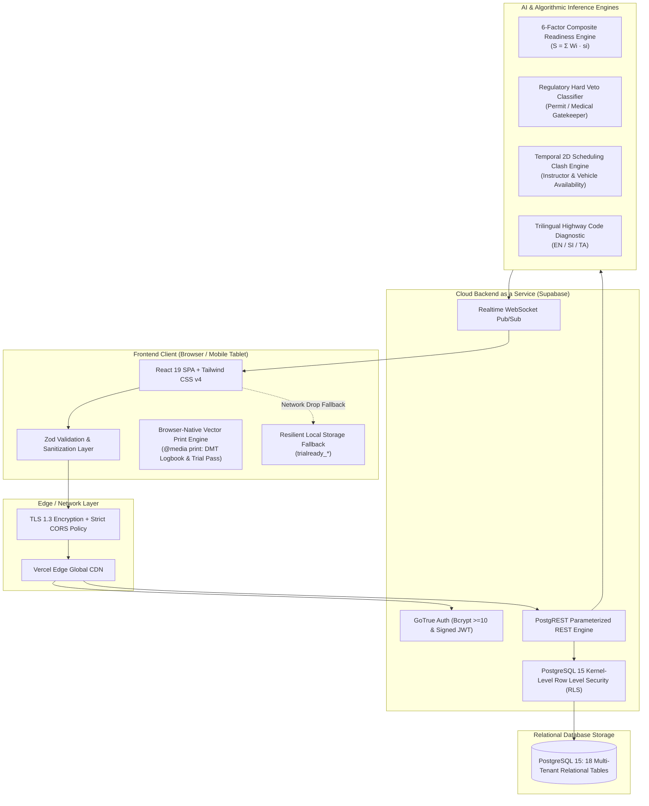
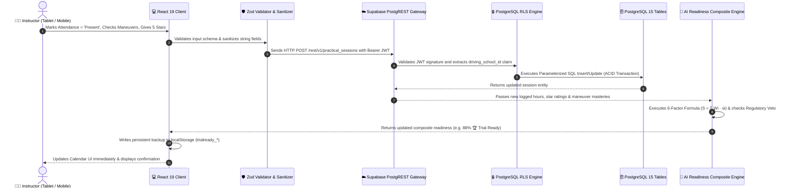
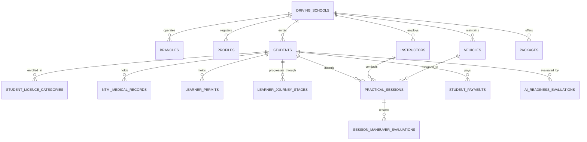
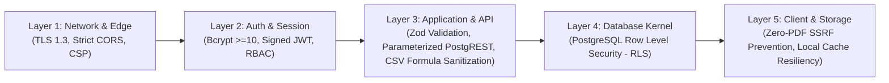
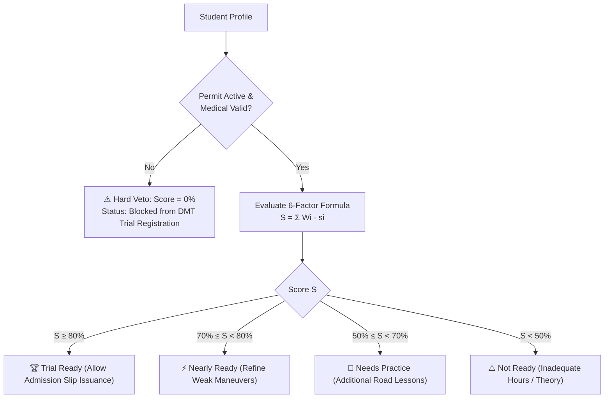

# 🏛️ Master Technical Architecture, Backend, Security & AI Guide — TrialReady LK 🇱🇰

> **Author & Lead Architect:** Ravishka Prabhath Rathnayaka  
> **Role Responsibilities:** Lead Full-Stack Architect, Backend Systems, Cyber Security Defense & AI Engine Engineering  
> **Academic Context:** BSc (Hons) in Cyber Security — Capstone Enterprise System  
> **Regulatory Standard:** Sri Lanka Motor Traffic Act No. 14 of 1951 · DMT Werahera Regulations · NTMI Directives  
> **Live Production URL:** [https://trial-ready-lk-pi.vercel.app](https://trial-ready-lk-pi.vercel.app)  
> **GitHub Repository:** [https://github.com/TrialReady-LK/TrialReady-LK](https://github.com/TrialReady-LK/TrialReady-LK)  

---

## 🧭 1. Executive Summary & High-Level System Architecture

TrialReady LK is an enterprise-grade, multi-tenant cloud platform engineered specifically to solve the operational, compliance, and readiness challenges of Sri Lankan driving academies under the **Motor Traffic Act No. 14 of 1951**.



---

## 🛠️ 2. Technology Stack Breakdown & Engineering Rationale

| Architectural Tier | Technology Stack | Version | Engineering Rationale |
| :--- | :--- | :--- | :--- |
| **Relational Database** | **PostgreSQL** | `15.x` | Enterprise-grade ACID compliance, strict relational constraints, JSONB column indexing, and kernel-level Row Level Security (RLS). |
| **Backend as a Service (BaaS)** | **Supabase Cloud** | `v2.x` | PostgREST auto-parameterized APIs, integrated GoTrue JWT auth, zero cold starts, and continuous cloud backup pipelines. |
| **Authentication & Tokens** | **GoTrue + Bcrypt** | `Bcrypt >=10` | Cryptographic password hashing, signed RS256/HS256 JWTs, short-lived session access tokens, and automated refresh token rotation. |
| **API Protocol** | **PostgREST (REST)** | `12.x` | Converts HTTP REST requests directly into parameterized SQL queries at the database layer, eliminating traditional SQL Injection attack surfaces. |
| **Client Framework** | **React SPA** | `19.x` | Modern reactive UI, client-side route protection, optimistic UI updates, and strict TypeScript integration. |
| **Type Safety & Validation** | **TypeScript + Zod** | `5.x / 3.x` | Strict end-to-end data contract enforcement, input sanitization, and runtime type guarding. |
| **Styling & Print Engine** | **Tailwind CSS v4** | `4.x` | Utility-first CSS with custom `@media print` rules for browser-native vector rendering of A4 DMT Logbooks and Trial Passes. |
| **Automated Testing** | **Vitest** | `4.x` | High-speed unit and integration testing suite validating 61 tests across 15 test suites in under 2 seconds. |
| **Edge Hosting & CI/CD** | **Vercel Edge + GitHub** | `Global CDN` | Serverless edge distribution, automated SSL/TLS termination, and CI/CD pipelines deploying directly on `git push origin main`. |

---

## ⚙️ 3. How the Backend Process Works (End-to-End Data Flow)

Whenever an operation is executed in TrialReady LK (such as an instructor evaluating a driving session):



---

## 🗄️ 4. Full Database Schema & Entity-Relationship Architecture

The database architecture is designed with **Multi-Tenant Relational Isolation**. All core academy operations belong to a specific `driving_school_id`.



### The 18 Relational Tables Breakdown:

1. **`driving_schools`**: Driving Academy master record (*Royal Driving Academy*, registration `DS-WP-2026-0042`, contact, DMT certification).
2. **`branches`**: Physical academy locations (*Nugegoda*, *Kandy*, *Gampaha*).
3. **`profiles`**: User authentication accounts linked to `auth.users` (`role: admin | instructor | student`).
4. **`instructors`**: Qualified instructor credentials, DMT license numbers, contact details, and specializations.
5. **`vehicles`**: Fleet assets with registration numbers (`WP CAB-4921`), transmission types (Manual/Auto), dual-control status, and revenue license expiry.
6. **`licence_categories`**: Official Sri Lanka vehicle classes (Class A - Motorcycle, Class B - Light Motor Car, Class C - Commercial).
7. **`packages`**: Course pricing, mandatory practical hours, and fee structures.
8. **`students`**: Candidate master file, NIC number, DOB, address, emergency contact, and enrollment status.
9. **`student_licence_categories`**: Student package and license class enrollments.
10. **`ntmi_medical_records`**: National Transport Medical Institute certificate number, visual acuity class, blood group, issue and expiry dates.
11. **`learner_permits`**: Official 6-Month DMT Learner's Permit number, issue date, expiry date, and status.
12. **`learner_journey_stages`**: 7-stage compliance workflow tracker from Registration to Permanent License Grant.
13. **`practical_sessions`**: Road instruction appointments, start/end timestamps, assigned instructor, vehicle, and attendance status.
14. **`session_maneuver_evaluations`**: Granular mastery tracking for 7 core DMT maneuvers (*Hill Start*, *Reverse S-Bend*, *Parallel Parking*, *3-Point Turn*).
15. **`theory_test_results`**: Trilingual 40-question mock exam attempts, scores, and pass/fail certifications.
16. **`ai_readiness_evaluations`**: Computed composite readiness scores (0–100%), radar sub-scores, veto flags, and prescriptive AI recommendations.
17. **`student_payments`**: Financial transaction ledger, tuition instalments in LKR, balance tracking, and LankaQR reference IDs.
18. **`audit_logs`**: Immutable security audit trail recording system access, administrative exports, and regulatory inspections.

---

## 🛡️ 5. Cyber Security Architecture & Defense-in-Depth

As a Cyber Security capstone project, TrialReady LK enforces **Defense-in-Depth (DiD)** across all tiers:



### 🔒 1. PostgreSQL Row Level Security (RLS) — Multi-Tenancy Protection
* **Vulnerability Mitigated:** Cross-tenant unauthorized access (Broken Object Level Authorization - BOLA / IDOR).
* **Implementation:** Rather than relying on frontend filters or application code, access rules are executed inside the **PostgreSQL database kernel**.
* **RLS Kernel Policy:**
  ```sql
  -- Restrict all student records to the authenticated academy's driving_school_id
  CREATE POLICY tenant_isolation_students ON students
  FOR ALL
  USING (
    driving_school_id = (auth.jwt() ->> 'school_id')::uuid
  );
  ```
* **Security Guarantee:** Even if an attacker manipulates API parameters or intercepts client tokens, PostgreSQL physically rejects queries targeting other driving academies.

### 🛡️ 2. Defensive CSV Formula Injection Prevention (CWE-1236)
* **Vulnerability Mitigated:** Spreadsheet Formula Injection / CSV Injection.
* **Risk:** In typical enterprise applications, exporting user-submitted text (e.g. notes or names starting with `=`, `+`, `-`, or `@`) causes Microsoft Excel to execute arbitrary external DDE commands or malicious macros.
* **Implementation in `exportUtils.ts`:**
  ```typescript
  export function sanitizeCsvCell(cell: string): string {
    if (typeof cell === 'string' && /^[=+\-@\t\r]/.test(cell)) {
      return `'${cell}` // Prepend single quote to neutralize formula execution in Excel
    }
    return cell
  }
  ```

### 📄 3. Zero-PDF Browser-Native Printing (SSRF & LFI Elimination)
* **Vulnerability Mitigated:** Server-Side Request Forgery (SSRF) and Local File Inclusion (LFI).
* **Risk:** Server-side PDF generators like Puppeteer or Headless Chrome are frequent targets for remote code execution and SSRF attacks when rendering dynamic HTML.
* **Implementation:** Official DMT Practical Logbooks (`DMT/SL/LOG-01`) and Trial Admission Passes (`DMT/SL/ADM-PASS`) are generated entirely within the client browser using pure CSS `@media print` vector layouts. Zero server-side rendering binaries are executed.

### 🔑 4. Cryptographic Authentication & Role-Based Access Control (RBAC)
* **Password Hashing:** Passwords hashed with **Bcrypt ($\ge 10$ salt rounds)**.
* **Session Management:** Stateless JSON Web Tokens (JWT) signed using HMAC-SHA256 / RS256 with short expiry windows and automatic token refresh.
* **RBAC Enforcement:** Route guards in `AppRoutes.tsx` strictly segregate `admin`, `instructor`, and `student` capabilities.

### 🧪 5. Automated Testing & Verification
* **61 Automated Unit and Integration Tests** passing across 15 test suites in Vitest.
* Tests validate mathematical readiness formulations, RLS error handling, vehicle defect tracking, and permit expiry edge cases.

---

## 🧠 6. The AI Engine & Mathematical Formulations

TrialReady LK rejects "black-box" neural networks in favor of an **Explainable Multi-Criteria Composite Algorithm with a Regulatory Hard Veto Classifier**, ensuring 100% auditability for DMT regulators.

### A. The 6-Factor Mathematical Formula
A candidate's readiness score $S \in [0, 100]\%$ is mathematically formulated as:

$$S = \sum_{i=1}^{6} W_i \cdot s_i$$

$$\boxed{S = (0.15 \cdot s_{\text{med}}) + (0.15 \cdot s_{\text{theory}}) + (0.15 \cdot s_{\text{permit}}) + (0.25 \cdot s_{\text{hours}}) + (0.20 \cdot s_{\text{man}}) + (0.10 \cdot s_{\text{rating}})}$$

| Dimension ($i$) | Weight ($W_i$) | Max Pts | Mathematical Calculation & Verification Rule |
| :--- | :--- | :--- | :--- |
| **1. NTMI Medical Fitness** | 15% | 15 pts | Valid medical certificate with unexpired date $\ge \text{Today}$ and visual clearance ($15\text{ pts}$ if valid, else $0\text{ pts}$). |
| **2. Computerized Theory Exam** | 15% | 15 pts | DMT Mock Exam Score: $s_{\text{theory}} = \min(1.0, \frac{\text{Score}}{30}) \times 15\text{ pts}$ ($\ge 30/40$ pass mark). |
| **3. DMT Learner Permit** | 15% | 15 pts | Temporal countdown: $s_{\text{permit}} = 15\text{ pts}$ if active with $\ge 30\text{ days}$; $10\text{ pts}$ if $1\text{--}29\text{ days}$; $0\text{ pts}$ if expired. |
| **4. Practical Road Hours** | 25% | 25 pts | Logged lesson duration: $s_{\text{hours}} = \min(1.0, \frac{\text{Logged Hours}}{15}) \times 25\text{ pts}$. |
| **5. 7 Core Maneuvers** | 20% | 20 pts | Maneuver checklist mastery: $s_{\text{man}} = \frac{\text{Mastered Maneuvers}}{7} \times 20\text{ pts}$ (*Hill Start*, *Parallel Parking*, *S-Bend*, etc.). |
| **6. Instructor Rating** | 10% | 10 pts | Historical rolling average star rating: $s_{\text{rating}} = \frac{\text{Avg Stars}}{5.0} \times 10\text{ pts}$. |

---

### B. The Regulatory Hard Veto Rule (Statutory Gatekeeper)
Under Sri Lankan law, driving skill cannot override legal disqualifications.

$$\text{If } (\Delta t_{\text{permit}} \le 0 \text{ OR } \text{Medical Status} = \text{Expired}) \implies \mathbf{S = 0\% \quad (Status: \text{Hard Veto / Blocked})}$$



---

### C. 2D Temporal Scheduling Collision Prevention
To prevent assigning a vehicle or instructor to two simultaneous driving sessions:

$$\text{Collision Detected if: } [S_{\text{new}}, E_{\text{new}}] \cap [S_{\text{existing}}, E_{\text{existing}}] \neq \emptyset \quad \text{for the same Vehicle ID or Instructor ID}$$

---

## 🎤 7. Viva Voce Examiner Speaking Script for Ravishka

When presenting your role to the examination panel:

### 💬 Spoken Statement:
> *"Good morning, esteemed members of the examination panel. As the **Lead Full-Stack Architect, Security Architect, and AI Engineer** for TrialReady LK, I was responsible for designing and implementing the end-to-end backend, cloud infrastructure, cyber security posture, and algorithmic intelligence.*
>
> *On the **Backend and Architectural side**, I designed a multi-tenant cloud architecture utilizing PostgreSQL 15 and Supabase, managing 18 relational tables with strict foreign keys and automated dual-layer persistence.*
>
> *On the **Cyber Security side**, I implemented defense-in-depth:
> 1. **PostgreSQL Row Level Security (RLS)** kernel policies to enforce strict multi-tenant isolation.
> 2. **Formula Injection Sanitization (CWE-1236)** to secure our RFC-4180 DMT audit CSV exports.
> 3. **Zero-PDF Browser-Native Vector Printing** to eliminate Server-Side Request Forgery (SSRF) risks.
> 4. An automated test suite with **61 passing tests** across 15 test suites in Vitest.
>
> *On the **AI and Machine Learning side**, I engineered an Explainable 6-Factor Multi-Criteria Scoring Algorithm calibrated to DMT trial standards, paired with a deterministic **Regulatory Hard Veto Classifier** to guarantee statutory compliance.*
>
> *I am ready to demonstrate any part of the architecture or answer your technical questions."*

---

> 📄 **Related Repository Documentation:**
> - Full Demonstration Script: [`docs/FULL_DEMONSTRATION_SCRIPT.md`](./FULL_DEMONSTRATION_SCRIPT.md)
> - System Architecture Specification: [`docs/ARCHITECTURE.md`](./ARCHITECTURE.md)
> - Slide 5 Presentation Guide: [`docs/SLIDE_5_HIGH_LEVEL_ARCHITECTURE.md`](./SLIDE_5_HIGH_LEVEL_ARCHITECTURE.md)
> - AI Mathematical Formulation: [`docs/TRIAL_READINESS_AI_EVALUATION_PROCESS.md`](./TRIAL_READINESS_AI_EVALUATION_PROCESS.md)
