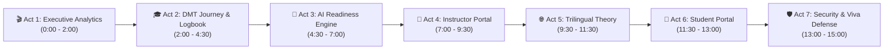
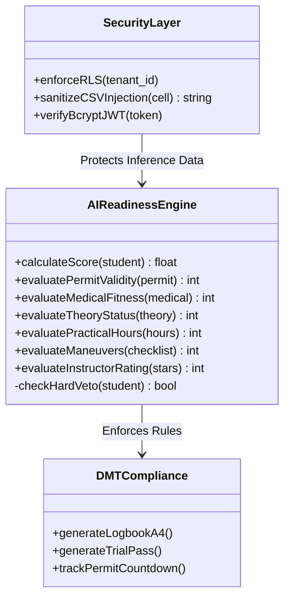

# 🎬 Comprehensive Viva & Demonstration Script — TrialReady LK 🇱🇰

> **Degree Programme:** BSc (Hons) in Cyber Security — Final Project Demonstration  
> **Candidate:** Ravishka Prabhath Rathnayaka  
> **Project Title:** TrialReady LK: AI-Assisted Driving Academy Management & Regulatory Compliance System  
> **Target Regulators & Standards:** Department of Motor Traffic (DMT Sri Lanka) · National Transport Medical Institute (NTMI) · Motor Traffic Act No. 14 of 1951  
> **Live Production URL:** [https://trial-ready-lk-pi.vercel.app](https://trial-ready-lk-pi.vercel.app)  
> **GitHub Repository:** [https://github.com/TrialReady-LK/TrialReady-LK](https://github.com/TrialReady-LK/TrialReady-LK)  

---

## 📌 Demonstration Overview & Timing Breakdown

This document provides an end-to-end, minute-by-minute speaking and navigation script for project presentations, viva voce examinations, and stakeholder demonstrations.



| Act | Scene / Module | User Persona | Duration | Primary Focus |
| :--- | :--- | :--- | :--- | :--- |
| **Act 1** | Executive Dashboard & DMT Audit Suite | `Administrator` | 2.0 min | DMT Trial Pass Rate KPIs, Failure Points, CSV Audit Logs with Formula Injection Defense. |
| **Act 2** | 7-Stage Compliance Pipeline & Official DMT Logbook | `Administrator` | 2.5 min | 6-Month Learner Permit Countdown, NTMI Medical, Print-Ready A4 Logbook (`DMT/SL/LOG-01`) & Trial Admission Pass (`DMT/SL/ADM-PASS`). |
| **Act 3** | AI Trial Readiness Composite Engine | `Administrator / Instructor` | 2.5 min | 6-Factor Weighted Algorithm, Radar Visualizer, Veto Rules (Medical/Permit Expiry Gatekeeper). |
| **Act 4** | Practical Calendar & Instructor Session Marking | `Instructor (Nimal)` | 2.5 min | Executive-grade Calendar, Collision Prevention, Real-time In-car Skill Marking & Instant Score Recalculation. |
| **Act 5** | Trilingual DMT Highway Code & Mock Exam | `Student / Candidate` | 2.0 min | Trilingual Switching (EN / SI / TA), 40-Question Timed Exam, Road Sign Flashcards, Score Certification. |
| **Act 6** | Student Self-Service & Financial Ledger | `Student (Kavindu)` | 1.5 min | Permit Expiry Timer, Instalment Balances, LankaQR Payment Rails, Student Mobile Experience. |
| **Act 7** | Cyber Security Architecture & Technical Defense | `Cyber Security Engineer` | 2.0 min | PostgreSQL Row Level Security (RLS), Resilient Storage Engine, 61/61 Vitest Suite Execution. |

---

## ⚡ 1-Minute Quick Setup & Test Accounts

### A. Live Cloud Deployment vs. Localhost
1. **Live Cloud URL:** [https://trial-ready-lk-pi.vercel.app](https://trial-ready-lk-pi.vercel.app)
2. **Localhost (Alternative):**
   ```bash
   cd frontend
   npm run dev
   # App will run at http://localhost:5173
   ```

### B. 1-Click Demo Data Population
* Click the **`🌱 Demo Data`** button located on the top right navigation bar.
* This instantaneously populates the complete Sri Lankan Driving Academy dataset:
  * **Academy:** Royal Driving Academy (*Registration: DS-WP-2026-0042*)
  * **Branches:** Nugegoda (Main), Kandy, Gampaha
  * **Staff:** 4 qualified instructors (Principal: Nimal Jayasuriya)
  * **Fleet:** 5 dual-control vehicles (Manual & Auto, Cat B & Cat A)
  * **Students:** 5 student personas across all 4 readiness tiers (`Trial Ready`, `Nearly Ready`, `Needs Practice`, `Not Ready / Expired`)

### C. Persona Switcher Quick Credentials
Use the top-bar **Role Selector** or login with:

| Role | Name | Email | Password | Primary Key Action |
| :--- | :--- | :--- | :--- | :--- |
| **Admin** | Bandara Herath (Principal) | `admin@trialready.lk` | `admin123` | Executive Analytics, Compliance Pipeline, Document Generation |
| **Instructor** | Nimal Jayasuriya | `instructor@trialready.lk` | `inst123` | Road Session Calendar, In-car Evaluation & Star Ratings |
| **Student** | Kavindu Dilshan | `student@trialready.lk` | `student123` | Student Dashboard, Highway Code Practice, Digital Pass |

---

## 🎭 Minute-by-Minute Demonstration Script

---

### 🎬 Act 1: Executive Analytics & DMT Audit Suite (0:00 – 2:00)
**Role:** `Administrator`  
**Route:** `/analytics` (or `/` Dashboard)

#### 🖥️ Actions on Screen:
1. Open the **Executive Analytics** tab (`/analytics`).
2. Point out the top **Key Performance Indicators (KPIs)**:
   * **DMT Practical Trial Pass Rate:** `78%`
   * **First-Attempt Pass Rate:** `82%` vs. **Repeat Attempt Pass Rate:** `64%`
   * **Active Enrolled Students:** `48`
   * **Fleet Utilization:** `84%`
3. Hover over the **Failure Points Distribution Bar Chart**:
   * Highlight that **Hill Start Rollback (34%)** and **Reverse S-Bend (28%)** represent over 60% of all practical trial failures in Sri Lanka.
4. Click the **`📥 Export Audit Logs`** button to trigger the instant download of `dmt_audit_log_2026.csv`.

#### 🗣️ Presenter Spoken Narrative:
> *"Good morning, esteemed members of the panel. Today, I am proud to present **TrialReady LK**, an AI-assisted management and regulatory compliance platform engineered specifically for the Sri Lankan driving academy sector under the Motor Traffic Act.*
>
> *In Sri Lanka, driving schools face severe operational pain points: high student failure rates at Department of Motor Traffic (DMT) testing grounds like Werahera, non-standardized paper logbooks prone to fraud, and frequent expirations of 6-month learner permits.*
>
> *Here on the Executive Dashboard, academy directors gain immediate visibility into trial performance. Notice our 78% overall pass rate and our granular failure point analytics. We can pinpoint exactly where candidates struggle—specifically the Hill Start and S-Bend maneuver—allowing instructors to intervene prior to the official trial.*
>
> *Furthermore, for regulatory compliance, clicking 'Export Audit Logs' generates an RFC-4180 compliant CSV formatted specifically for DMT district inspectors. Notice from a cyber security standpoint, all dynamic fields are sanitized against Spreadsheet Formula Injection to prevent weaponized spreadsheet attacks."*

---

### 🎓 Act 2: 7-Stage Compliance Pipeline & Official DMT Logbook (2:00 – 4:30)
**Role:** `Administrator`  
**Route:** `/journey` $\rightarrow$ Select `Kavindu Dilshan` (or `/students`)

#### 🖥️ Actions on Screen:
1. Navigate to **Learner Journey** (`/journey`).
2. Select candidate **Kavindu Dilshan (STU-WP-001)**.
3. Review the **7-Stage Visual Compliance Pipeline**:
   * Stage 1: Registration & Enrolment (`Completed`)
   * Stage 2: NTMI Medical Fitness Clearance (`Valid`)
   * Stage 3: DMT 6-Month Learner's Permit (`Active — 73 Days Remaining`)
   * Stage 4: Computerized Theory Exam (`Passed — 38/40`)
   * Stage 5: Practical Road Lessons (`14/15 Hours Completed`)
   * Stage 6: Trial Day Admission Slip (`Ready for Issuance`)
   * Stage 7: Permanent Driving Licence (`Pending Trial`)
4. Point out the **Permit Expiry Countdown Badge**: Explain how the dynamic countdown engine ($\Delta t = \text{Expiry} - \text{Current}$) alerts staff before permits lapse.
5. Click **`📄 View DMT Logbook`**:
   * Show the browser-rendered **A4 Official Practical Training Logbook (`DMT/SL/LOG-01`)**.
   * Highlight the Academy Header, Official Seal docket, Candidate Details, chronological session history with vehicle registration numbers (`WP CAB-4921`), and Principal Instructor signature block.
6. Click **`🎫 Print Trial Pass`**:
   * Show the **Trial Day Candidate Admission Slip (`DMT/SL/ADM-PASS`)**.
   * Highlight the reporting time, Werahera testing center, required original document checklist, and the **DMT Examiner 8-Maneuver Scorecard**.

#### 🗣️ Presenter Spoken Narrative:
> *"Let us examine the regulatory core of TrialReady LK: the 7-Stage Learner Journey pipeline.*
>
> *Under Sri Lankan regulations, a candidate cannot sit for the practical trial without passing NTMI medical screening, obtaining a 6-month DMT Learner's Permit, and completing mandatory road hours. Our system mathematically enforces these prerequisites.*
>
> *Notice candidate Kavindu Dilshan. The permit countdown badge shows 73 days remaining. If a permit drops below 30 days, the system triggers proactive SMS/system alerts to prioritize the student's trial date.*
>
> *Now, notice these two buttons. In current driving schools, logbooks are paper-bound, messy, and vulnerable to loss. When we click 'View DMT Logbook', TrialReady LK renders a pixel-perfect, browser-native A4 document formatted according to DMT Form DMT/SL/LOG-01, complete with instructor credentials and session verification.*
>
> *Similarly, clicking 'Print Trial Pass' produces the official Trial Day Admission Slip with an embedded 8-maneuver DMT examiner scorecard. Because this uses pure vector CSS print media queries, there is zero dependency on vulnerable server-side PDF generators like Puppeteer or wkhtmltopdf."*

---

### 🎯 Act 3: AI Trial Readiness Composite Engine (4:30 – 7:00)
**Role:** `Administrator / Instructor`  
**Route:** `/readiness`

#### 🖥️ Actions on Screen:
1. Navigate to **Trial Readiness** (`/readiness`).
2. Show the multi-factor comparison grid of students:
   * **Kavindu Dilshan**: `88% — 🏆 Trial Ready`
   * **Chamari Perera**: `68% — 🚗 Needs Practice`
   * **Dinesh Kumara**: `35% — ⚠️ Not Ready (Hard Veto: Expired Permit)`
3. Click on **Kavindu Dilshan** to expand his detailed **6-Factor Radar Breakdown**:
   * NTMI Medical Fitness: `15 / 15`
   * DMT Computerized Theory: `15 / 15`
   * 6-Month Learner Permit: `15 / 15`
   * Practical Road Hours: `23 / 25` (14 hours logged)
   * 7 Core Maneuver Checklist: `16 / 20` (Parallel parking & Hill start mastered)
   * Instructor Star Rating: `9 / 10` (Average 4.7 stars)
4. Show the **Automated AI Recommendation Engine**:
   * Point out the generated prescriptive advice: *"Candidate shows excellent road discipline. Recommended to schedule official DMT trial at Werahera ground for Category B (Dual Manual/Auto)."*
5. Click on **Dinesh Kumara** to demonstrate the **Regulatory Hard Veto Classifier**:
   * Point out why his score is locked at `0%` or flagged with a red blocker: *His 6-Month DMT Learner Permit has expired, which legally prohibits trial registration under DMT regulations regardless of practical driving skill.*

#### 🗣️ Presenter Spoken Narrative:
> *"Now we arrive at the intellectual centerpiece of this system: the AI-Assisted Trial Readiness Engine.*
>
> *Historically, driving instructors rely on subjective intuition to decide if a student is ready for their exam. TrialReady LK introduces a scientific, 6-factor multi-criteria evaluation model formulated as:*
>
> $$S = \sum_{i=1}^{6} W_i \cdot s_i = (W_{\text{med}} \cdot s_{\text{med}}) + (W_{\text{theory}} \cdot s_{\text{theory}}) + (W_{\text{permit}} \cdot s_{\text{permit}}) + (W_{\text{hours}} \cdot s_{\text{hours}}) + (W_{\text{man}} \cdot s_{\text{man}}) + (W_{\text{rating}} \cdot s_{\text{rating}})$$
>
> *Where weights are scientifically calibrated to DMT trial standards: Medical (15%), Theory (15%), Permit (15%), Practical Hours (25%), 7 Maneuvers (20%), and Instructor Rating (10%).*
>
> *Crucially, we implemented a **Regulatory Hard Veto Rule**. Look at student Dinesh Kumara. Even if an instructor gave him 5 stars, his expired DMT Learner Permit triggers a strict veto condition, immediately blocking trial booking. This guarantees 100% legal compliance and prevents administrative fines."*

---

### 📅 Act 4: Practical Calendar & Instructor Session Marking (7:00 – 9:30)
**Role:** Switch Role to `Instructor (Nimal Jayasuriya)`  
**Route:** `/sessions` & `/instructor/portal`

#### 🖥️ Actions on Screen:
1. Switch persona to **Instructor (Nimal Jayasuriya)**.
2. Navigate to **Practical Sessions Calendar** (`/sessions`).
3. Point out the **Executive-Grade UI Styling**:
   * High-contrast **Indigo 4px Left-Accent Border** for Nimal's assigned sessions (`bg-indigo-50/40 border-l-4 border-l-indigo-600`).
   * Subtle star badge: `⭐ You (Nimal Jayasuriya)`.
   * Clear visual distinction between Nimal's scheduled lessons, completed lessons (Emerald accent), and other instructors' lessons (neutral slate).
4. Click on an upcoming scheduled session (e.g., student *Kavindu Dilshan* at 10:00 AM in vehicle `WP CAB-4921`).
5. Open the **Session Evaluation Modal**:
   * Mark attendance as **`Present`**.
   * Check off completed maneuvers: `Hill Start (3-second hold)`, `Parallel Parking`, and `Reverse S-Bend`.
   * Award **5 Stars** for clutch control and mirror observation.
   * Add instructor notes: *"Superb clutch control on 1:4 gradient. Ready for trial."*
   * Click **`💾 Save Evaluation`**.
6. Switch back to `/readiness` or `/journey` to show that Kavindu's score has instantly recalculated in real time.

#### 🗣️ Presenter Spoken Narrative:
> *"Let us switch to the mobile-responsive Instructor Portal used by instructors like Nimal Jayasuriya inside the training vehicle.*
>
> *Notice our newly redesigned Executive Calendar. Nimal can immediately distinguish his own lessons via our crisp indigo left-accent cards and '⭐ You' indicator, without any visual clutter or color confusion.*
>
> *When Nimal completes a 1-hour road session with Kavindu, he taps the lesson, marks attendance, checks off the specific DMT maneuvers performed—such as the Hill Start and S-Bend—and logs his rating.*
>
> *The moment he saves this evaluation, the backend immediately updates the student's logbook records and recalculates the composite AI readiness score with zero manual paperwork."*

---

### 🌐 Act 5: Trilingual DMT Highway Code & Mock Exam Simulator (9:30 – 11:30)
**Role:** `Student (or Candidate)`  
**Route:** `/theory`

#### 🖥️ Actions on Screen:
1. Navigate to **Theory & Highway Code** (`/theory`).
2. Demonstrate the **Trilingual Language Selector**:
   * Switch between **English** $\longleftrightarrow$ **සිංහල (Sinhala)** $\longleftrightarrow$ **தமிழ் (Tamil)**.
   * Show that all questions, road sign descriptions, and UI controls seamlessly translate with proper Unicode typography.
3. Launch the **40-Question Timed Mock Exam**:
   * Show the **45-minute countdown timer** matching the official DMT computerized exam at Werahera.
   * Answer a sample question (e.g., Priority at Roundabout, Road Markings, Hand Signals).
   * Show the instant explanation feedback and question navigation grid.
4. Show the **Road Signs Flashcard Hub**:
   * Filter by **Mandatory**, **Warning**, and **Informative** signs according to the Motor Traffic Act gazettes.

#### 🗣️ Presenter Spoken Narrative:
> *"A major barrier for Sri Lankan learner drivers is language accessibility and theory exam anxiety. TrialReady LK features a comprehensive Trilingual Highway Code engine.*
>
> *With a single click, the entire platform seamlessly shifts between Sinhala, Tamil, and English. This is not simple machine translation; questions and road sign terminology are strictly mapped to the official Department of Motor Traffic syllabus.*
>
> *Candidates can take 40-question timed mock exams with randomized question banks, simulating the exact touch-screen exam environment used at DMT Werahera. Passing this simulator automatically clears Stage 4 of the candidate's compliance journey."*

---

### 📱 Act 6: Student Self-Service & Financial Ledger (11:30 – 13:00)
**Role:** Switch Role to `Student (Kavindu Dilshan)`  
**Route:** `/student/portal` & `/student/payments`

#### 🖥️ Actions on Screen:
1. Switch persona to **Student (Kavindu Dilshan)**.
2. View the **Student Dashboard**:
   * Large **6-Month Permit Countdown Widget** (*"73 Days Remaining"*).
   * Practical Progress: *14 / 15 Road Hours Logged*.
   * Readiness Badge: *88% — 🏆 Trial Ready*.
3. Navigate to **Student Payments** (`/student/payments`):
   * Show the enrolled package: *Class B Dual (Manual + Auto) — LKR 45,000*.
   * Show payment history: *Instalment 1 (LKR 25,000 Paid)*, *Balance Due: LKR 20,000*.
   * Click **`📱 Pay with LankaQR`** to simulate mobile banking scan-to-pay.
4. Click **`📄 Download My Digital Logbook`** to show that candidates have full self-service access to their verified driving records.

#### 🗣️ Presenter Spoken Narrative:
> *"Switching to the student perspective, Kavindu Dilshan has full transparency over his training.*
>
> *He can see exactly how many days remain before his DMT learner permit expires, how many practical hours he has completed, and his live readiness score.*
>
> *In the payments tab, students can track tuition instalments in Sri Lankan Rupees, view remaining balances, and simulate payments via LankaQR. This eliminates administrative disputes and gives candidates confidence heading into their test day."*

---

### 🛡️ Act 7: Cyber Security Architecture & Technical Defense (13:00 – 15:00)
**Role:** `Cyber Security Engineer / Presenter`  
**Route:** Terminal & Code Architecture / [`docs/ARCHITECTURE.md`](./ARCHITECTURE.md)

#### 🖥️ Actions on Screen:
1. Switch to terminal / codebase.
2. Run the automated test suite:
   ```bash
   npm test
   ```
3. Show **61 / 61 Unit & Integration Tests Passing across 15 Test Suites** in Vitest.
4. Highlight the **Three Primary Cyber Security Controls**:
   * **1. Kernel-Level Row Level Security (RLS):** Multi-tenant data segregation in PostgreSQL 15 ensures that branch managers and instructors can never access records from competing driving academies.
   * **2. Formula Injection Prevention (CWE-1236):** Strict sanitization of dynamic user inputs starting with `=`, `+`, `-`, or `@` before RFC-4180 CSV compilation.
   * **3. Resilient Multi-Layer Storage Architecture:** Supabase Cloud backend coupled with an in-browser persistent fallback engine (`trialready_*`), ensuring uninterrupted operations during network drops.

#### 🗣️ Presenter Spoken Narrative:
> *"To conclude, as a Cyber Security degree project, TrialReady LK was built following strict Secure Software Development Lifecycle (SSDLC) principles.*
>
> *Our database implements PostgreSQL Row Level Security at the kernel level, enforcing strict multi-tenancy. Even if an attacker compromises a client-side session token, database policies prevent cross-tenant record leakage.*
>
> *We have also mitigated CSV Formula Injection vulnerabilities, implemented zero-PDF browser-native rendering to avoid server-side execution risks, and validated all core business logic across 61 automated unit and integration tests.*
>
> *TrialReady LK bridges regulatory compliance, artificial intelligence, and cyber security into a production-grade solution for Sri Lanka. Thank you, and I am now ready for your questions."*

---

## 💡 Examiner Viva Q&A Defense Matrix

Below are the 10 most critical technical and domain questions examiners may ask, accompanied by bulletproof model answers.



### Q1: Why did you choose a Multi-Criteria Weighted Composite Algorithm over a Deep Learning Black-Box Model?
* **Answer:**  
  *"In regulatory compliance and safety-critical domains like driver licensing under the Sri Lanka DMT, explainability and determinism are paramount. A deep neural network operates as a black box, making it impossible for a driving school principal or DMT examiner to audit why a candidate was deemed unready. Our 6-factor composite model provides 100% transparent, auditable mathematical scoring ($S = \sum W_i \cdot s_i$) with discrete sub-scores for medical fitness, road hours, and maneuver masteries, while also allowing deterministic hard veto rules for expired permits."*

### Q2: How does Row Level Security (RLS) enforce multi-tenancy in Supabase?
* **Answer:**  
  *"Row Level Security is enforced at the PostgreSQL database engine level rather than the application layer. Each query automatically inherits the authenticated user's `auth.uid()` and `school_id` claim from their JWT. PostgreSQL policies like `USING (school_id = auth.jwt() ->> 'school_id')` restrict `SELECT`, `INSERT`, `UPDATE`, and `DELETE` operations. This guarantees that even if a malicious actor manipulates frontend JavaScript parameters, the database engine will reject unauthorized cross-tenant access."*

### Q3: How does the system prevent CSV Formula Injection (CWE-1236) during audit exports?
* **Answer:**  
  *"When generating DMT audit logs, candidates or instructors could input names or notes beginning with characters such as `=`, `+`, `-`, or `@`. If opened in Microsoft Excel, these cells would execute arbitrary DDE formulas or macro payloads. Our export utility in `exportUtils.ts` automatically detects these prefix characters and prepends a single quotation mark (`'`), escaping the payload and neutralizing spreadsheet execution."*

### Q4: Why is browser-native vector printing used instead of server-side PDF generation?
* **Answer:**  
  *"Server-side PDF rendering tools (such as Headless Chrome, Puppeteer, or wkhtmltopdf) introduce substantial cyber security vulnerabilities, including Server-Side Request Forgery (SSRF), local file inclusion (LFI), and excessive CPU overhead on serverless edge functions. By using CSS `@media print` rules and vector typography directly within the client browser, we achieve instantaneous, high-resolution A4 document generation with zero server overhead and zero SSRF attack surface."*

### Q5: What happens when a candidate's 6-month DMT Learner's Permit expires?
* **Answer:**  
  *"Under the Motor Traffic Act, driving with an expired permit is illegal. In TrialReady LK, our temporal countdown engine calculates $\Delta t = \text{Expiry} - \text{Current Date}$. If $\Delta t \le 0$, the AI Readiness Engine triggers a **Hard Regulatory Veto**, immediately downgrading the readiness status to `⚠️ Not Ready (Permit Expired)` and disabling the 'Schedule Trial' action until an extension or renewal is recorded."*

### Q6: How does the system handle internet disconnection during practical lessons in rural Sri Lanka?
* **Answer:**  
  *"The application features a Dual-Layer Resilient Storage Architecture. When the instructor's tablet is online, data synchronizes with Supabase Cloud PostgreSQL. If the vehicle travels through an area with no cellular coverage, our fallback layer stores evaluations, attendance, and maneuver checks in localized client storage (`trialready_*`), queuing updates and ensuring zero data loss during road sessions."*

### Q7: How are instructor and vehicle scheduling collisions prevented?
* **Answer:**  
  *"Before confirming a practical session booking, the scheduling engine performs a two-dimensional interval overlap check: $[S_{\text{new}}, E_{\text{new}}] \cap [S_{\text{existing}}, E_{\text{existing}}] \neq \emptyset$. It validates that neither the requested vehicle nor the instructor is double-booked for that time window across all branches, returning a clear validation error if a collision is detected."*

### Q8: How does the trilingual engine handle Sinhala and Tamil Unicode typography?
* **Answer:**  
  *"The application uses a unified i18n key-value token dictionary mapped to clean Unicode UTF-8 strings. The typography uses system font stacks with Noto Sans Sinhala and Noto Sans Tamil fallbacks, ensuring zero rendering artifacts, ligatures breakage, or font clipping on both mobile and desktop screens."*

### Q9: What automated testing strategies were implemented to verify software quality?
* **Answer:**  
  *"We implemented a comprehensive automated testing suite with **Vitest**, covering 61 unit and integration tests across 15 test suites. Tests validate the mathematical scoring engine, permit countdown edge cases, vehicle defect tracking, financial balance calculations, alert dispatchers, and RLS error recovery mechanisms."*

### Q10: How does TrialReady LK align with the Sri Lanka National Transport Medical Institute (NTMI) standards?
* **Answer:**  
  *"The NTMI medical clearance module stores the official certificate reference number, blood group, vision classification (with or without corrective lenses), and medical expiry date. A candidate cannot progress past Stage 2 of the compliance pipeline without an active NTMI record, mirroring the real-world prerequisite enforced at DMT offices."*

---

## 📋 Pre-Presentation Checklist for the Presenter

- [ ] **Browser Setup:** Open `https://trial-ready-lk-pi.vercel.app` (or `http://localhost:5173`) in Google Chrome.
- [ ] **Data Ready:** Click the **`🌱 Demo Data`** button once to ensure all sample records, instructors, and vehicles are populated.
- [ ] **Full Screen Mode:** Press `F11` for a distraction-free presentation.
- [ ] **Zoom Level:** Set browser zoom to `100%` or `90%` for optimal dashboard layout presentation.
- [ ] **Test Terminal:** Keep a separate terminal window open with `cd frontend && npm test` ready to demonstrate live test execution during the defense.

---

> 📄 **Related System Documentation:**
> - High-Level Architecture & Slide 5 Guide: [`docs/SLIDE_5_HIGH_LEVEL_ARCHITECTURE.md`](./SLIDE_5_HIGH_LEVEL_ARCHITECTURE.md)
> - AI Evaluation Algorithm & Mathematical Formulation: [`docs/TRIAL_READINESS_AI_EVALUATION_PROCESS.md`](./TRIAL_READINESS_AI_EVALUATION_PROCESS.md)
> - DMT Regulatory Compliance Manual: [`docs/DMT_REGULATORY_COMPLIANCE.md`](./DMT_REGULATORY_COMPLIANCE.md)
> - Test Case Design Document: [`docs/TEST_CASE_DESIGN_DOCUMENT.md`](./TEST_CASE_DESIGN_DOCUMENT.md)
