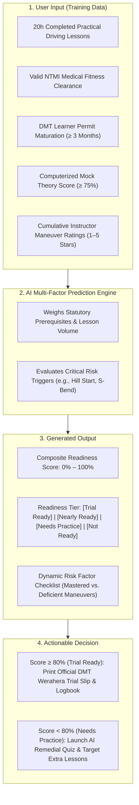

# TrialReady LK — User Manual
**AI-Assisted Driving School ERP & Statutory DMT Regulatory Compliance Platform**

---

## 1. Cover Page

* **Application Name:** TrialReady LK (Cloud-Native Driving School ERP & Statutory Regulatory Compliance Platform)
* **Group Identification:** Group 03
* **Academic Module:** Technology Challenge Competition (TCC) Module (CCS2360 / CCS3361)
* **Degree Specialization:** BSc (Hons) in Cyber Security
* **Faculty & Institution:** Faculty of Computing and IT, Sri Lanka Technology Campus (SLTC), Padukka
* **Academic Year:** 2026
* **Application Version:** v1.0.0 (Production Release)
* **Target Submission Document:** `Group03_UserManual.pdf`

### Project Team Members & Registration Details
| Student Full Name | Student Registration No. | Project Assignment & Focus |
| :--- | :--- | :--- |
| **Loshan Mihisara** | CIT-24-01-0249 | Group Leader / System Analyst & Requirements Lead |
| **Ravishka Rathnayake** | CIT-24-01-0251 | Lead Full-Stack Engineer & Cyber Security Architect |
| **Lasindu Dilshan** | CIT-24-01-0488 | Frontend UI/UX & Responsive Experience Specialist |
| **Manura Anuhas** | CIT-24-01-0075 | QA Test Automation & Database Systems Engineer |

---

## 2. System Overview

### 2.1 What the Application Does
**TrialReady LK** is a centralized, enterprise-grade cloud ERP platform purpose-built for Sri Lankan driving schools to streamline student management, automate compliance tracking with the Department of Motor Traffic (DMT) and National Transport Medical Institute (NTMI), manage dual-control training fleets, and predict practical trial readiness using artificial intelligence.

### 2.2 Target Users
1. **Driving School Administrators:** Manage operations, multi-branch fleets, billing/packages, DMT statutory audit exports, and instructor scheduling.
2. **Driving Instructors:** View daily lesson timetables, track student practical skills progress, record lesson attendance, and generate AI student session feedback.
3. **Learner Drivers (Students):** Monitor their 7-stage DMT journey, track learner permit expiry, take trilingual computerized theory mock exams, review their AI trial readiness score, and view official logbooks.

### 2.3 Main Features
* **Statutory 7-Stage Journey Pipeline:** Automatic milestone progression from NTMI medical and 3-month learner permit maturation to practical trials.
* **Conflict-Free Fleet & Lesson Scheduling:** Real-time scheduling preventing overlapping instructor and vehicle allocations.
* **Financial Ledger & Tiered Packages:** Automated fee installments, invoice balances, payment receipts, and balance alerts.
* **Trilingual Computerized Theory Exam Simulator:** Authentic DMT exam simulation with timed tests, road sign flashcards, and instant explanations in English, Sinhala (සිංහල), and Tamil (தமிழ்).
* **Official DMT Logbook & Admission Slip Generator:** Automated 1-click printable government compliance documents.

### 2.4 AI/ML Functionality
* **Multi-Factor Practical Trial Readiness Predictor:** Synthesizes completed practical hours, 3-month permit maturation, medical clearance, mock theory exam history, and instructor continuous rating scores to output an objective trial success probability (0–100%) and readiness classification tier.
* **Adaptive AI Remedial Quiz Generator:** Automatically analyzes past mock exam mistakes and generates focused remedial question sets targeting student-specific weaknesses.
* **Intelligent AI Academy Copilot:** Provides instant operational summaries, scheduling assistance, and regulatory advisory via an interactive chat widget.

---

## 3. System Requirements & Access

### 3.1 Technical Requirements
* **Supported Operating Systems:** Windows 10/11, macOS 12+, Linux (Ubuntu 20.04+), Android 11+, iOS 15+.
* **Recommended Web Browsers:** Google Chrome (v110+), Microsoft Edge (v110+), Mozilla Firefox (v110+), Apple Safari (v16+).
* **Internet Connection:** Minimum 2 Mbps stable broadband or 4G/5G mobile connection.
* **Hardware Requirements:** Minimum 2 GB RAM, 1280x720 display resolution (fully responsive on mobile, tablet, and desktop).
* **Dependencies (Local Run):** Node.js v20+, modern package manager (`npm`), and modern browser.

### 3.2 Access URL & Demo Login Credentials
* **Application Access URL:** `http://localhost:5173/` (or hosted production URL).
* **Quick Demo Access:** The Login screen provides **1-Click Quick Demo Login** buttons for all three roles.

| Role | Login Email | Password | Assigned Landing Portal |
| :--- | :--- | :--- | :--- |
| **Administrator** | `admin@drivingschool.lk` | `Admin@123` | `/dashboard` (Executive Command Center) |
| **Instructor** | `instructor@drivingschool.lk` | `Instructor@123` | `/instructor/portal` (Instructor Daily Agenda) |
| **Student (Learner)** | `student@drivingschool.lk` | `Student@123` | `/student/portal` (Learner Progress Hub) |

---

## 4. How to Use the System

### 4.1 Logging In & Role Navigation
1. Open the browser and visit the application URL.
2. In the **Sign In** screen, enter your assigned email and password, or click one of the **Quick Demo Login** badges (`Admin`, `Instructor`, or `Student`).
3. Click **Sign In to Academy**. The system validates your credentials and redirects you directly to your role-specific dashboard.
4. To switch profiles or log out, click your avatar on the top navigation bar and select **Sign Out**.

---

### 4.2 Learner Registration & Journey Tracking (Admin)
1. From the left navigation menu, click **Students** or **Learner Journey**.
2. To register a new learner, click **+ Add Student**, fill in personal details, NIC/Passport, phone number, branch, and licence category (e.g., *Class B — Auto/Manual*), then click **Save**.
3. In the **Learner Journey Pipeline**, monitor student progress across all 7 statutory stages:
   * **Stage 1:** Student Enrolled & Registered
   * **Stage 2:** NTMI Medical Certificate Cleared
   * **Stage 3:** DMT Learner Permit Issued & 3-Month Countdown Active
   * **Stage 4:** Computerized Theory Exam Cleared
   * **Stage 5:** Practical Driving Lessons Completed (Minimum 20 Hours)
   * **Stage 6:** AI Trial Readiness Verified (Score ≥ 80%)
   * **Stage 7:** DMT Practical Trial Passed & Driving Licence Issued
4. To update a document (e.g., Medical or Learner Permit), click on the student row, select **Update Permit** or **Update Medical**, enter the certificate number and issue/expiry dates, and click **Save Details**.

---

### 4.3 Practical Training Scheduling & Attendance Marking (Admin & Instructor)
1. Select **Practical Sessions** from the sidebar.
2. Toggle between **Calendar View** and **List View** to view booked training sessions.
3. To schedule a new driving lesson:
   * Click **+ Schedule Lesson**.
   * Select the **Student**, **Licence Category**, **Instructor**, **Vehicle**, **Date**, and **Time Slot**.
   * *Conflict Protection:* The system automatically validates schedules in real time. If the selected instructor or dual-control vehicle is already booked during that hour, a high-priority warning will prevent double-booking.
   * Select practical skills to cover (e.g., *Clutch Control, Hill Start, Parallel Parking*) and click **Confirm Booking**.
4. To record lesson attendance and instructor feedback:
   * On the session card, click **Mark Attendance**.
   * Select status (**Present**, **Late**, or **Absent**).
   * Check off skills mastered during the drive.
   * Award an **Instructor Performance Rating** (1 to 5 Stars).
   * Enter instructor remarks and click **Save Evaluation**.

---

### 4.4 Trilingual Theory Exam Simulator & Road Signs (Student & Admin)
1. Navigate to **Theory Hub** from the sidebar menu.
2. Select your preferred examination language using the trilingual toggle: **English**, **සිංහල (Sinhala)**, or **தமிழ் (Tamil)**.
3. Click **Start Mock Exam** to launch the official 40-question computerized exam.
4. An automated 45-minute exam timer begins. Answer multiple-choice questions and navigate between questions using the bottom Question Palette.
5. Click **Finish & Submit Test** to view immediate evaluation:
   * Percentage score, correct/incorrect count, and official DMT pass/fail status (Pass standard: ≥ 75%).
   * Click **Review All Questions & Explanations** to inspect official Highway Code rationales for any incorrect answers.
6. Under **Road Signs Flashcards**, flip through interactive vector regulatory, warning, and priority traffic signs to review meanings.

---

### 4.5 AI/ML Trial Readiness Evaluation (Main AI Workflow)
This is the core predictive machine learning feature of TrialReady LK that prevents premature student trial failures.

#### Step-by-Step AI Execution Instructions:
1. Navigate to **Trial Readiness** from the sidebar (or view the student's detail profile).
2. The system automatically ingests the student's latest training history, test scores, and compliance dates.
3. Click on the student name to inspect the **AI Evaluation Modal**:
   * **Required Input Data:** Accumulated practical hours, medical status, permit issue date, mock exam average, and maneuver ratings.
   * **Generated Output:** A visual circular gauge displays the **Readiness Score (e.g., 88%)** alongside the **Readiness Tier** badge:
     * **Trial Ready (≥ 80%):** Candidate is fully prepared for official DMT practical driving test.
     * **Nearly Ready (65%–79%):** Minor polish needed (1–2 extra sessions recommended).
     * **Needs Practice (40%–64%):** Candidate requires additional road hours.
     * **Not Ready (< 40%):** Essential statutory milestones (medical/permit/theory) missing.
   * **Actionable Next Steps:**
     * If deficient in road signs or theory, click **Launch AI Remedial Quiz** to generate a personalized practice session.
     * If qualified, click **Generate DMT Logbook** or **Print Trial Pass** to print official statutory documentation for the DMT test ground.

---

### 4.6 Financial Billing & Tuition Packages (Admin)
1. Select **Financials** from the sidebar menu.
2. View academy cash flow, pending balances, collected revenue, and overdue tuition accounts.
3. To assign a training package to a student, click **Packages**, select a package (e.g., *Standard Light Vehicle B — LKR 48,000*), and assign it to the student.
4. To record fee collections:
   * Click **Record Payment**.
   * Select the student, enter amount paid (e.g., *LKR 20,000*), payment method (*Cash, Bank Transfer, Card*), and enter receipt remarks.
   * Click **Save Payment**.
   * Click **View Receipt** to generate a printable payment receipt with remaining balance breakdown.

---

## 5. Screen Layouts & User Interface Reference

* **Figure 1: Role-Based Authentication & Quick Login Screen**
  * *Description:* Secure login portal featuring multi-branch selection, credentials authentication, and instant 1-click test account buttons for Administrator, Senior Instructor, and Learner Student.
* **Figure 2: Executive Driving Academy Operations Dashboard**
  * *Description:* Real-time KPI summary showing active student count, fleet operational vehicles, practical sessions scheduled today, tuition revenue collected, and quick navigation shortcuts.
* **Figure 3: Learner Journey Pipeline & Statutory DMT Tracker**
  * *Description:* 7-stage visual milestone pipeline displaying NTMI medical status, 3-month permit maturation countdown, theory test status, and completed practical driving hours.
* **Figure 4: AI Practical Trial Readiness Predictor Screen**
  * *Description:* Predictive evaluation display presenting the composite Readiness Score (0–100%), Readiness Tier classification, dynamic risk checklist, and 1-click AI Remedial Quiz generator.
* **Figure 5: Computerized Trilingual Theory Exam Simulator & Result View**
  * *Description:* Realistic 40-question computerized test interface with synchronized 45-minute countdown clock, trilingual language switcher (EN/SI/TA), SVG road sign illustrations, and post-exam explanation modal.
* **Figure 6: Conflict-Aware Practical Session Scheduler**
  * *Description:* Interactive weekly calendar view showing booked training sessions, real-time vehicle/instructor conflict alerts, and fast attendance grading modal.

---

## 6. Error Handling & Troubleshooting Guide

| Common Problem | Root Cause | Recommended Solution |
| :--- | :--- | :--- |
| **Invalid Login / Access Denied** | Incorrect email or password entered. | Double-check credentials. For quick testing, click one of the 1-Click Demo Login buttons (`Admin`, `Instructor`, or `Student`) on the login screen. |
| **Schedule Conflict Detected** | The requested instructor or vehicle is already booked for another driving session during the chosen time. | The system prevents overlapping bookings. Choose an alternative time slot, select another available vehicle, or assign a different certified instructor. |
| **Trial Booking Blocked (Missing Milestones)** | Student has not completed minimum 20 practical hours, medical is missing, or learner permit has not reached 3 months. | Check the **Learner Journey** tab. Complete pending statutory requirements, record practical lesson attendance, or wait for the legal permit wait period to mature. |
| **Theory Exam Interruption / Refresh** | Accidental browser refresh or momentary internet disconnect during mock exam. | TrialReady LK automatically saves test state in browser storage. Reopen `/theory/exam` and click **Resume Exam** to continue without losing your answers or elapsed time. |

---

### Submission Verification Checklist
* [x] Strictly conforms to the 2–3 page concise preparation guidelines.
* [x] Formatted with all 6 required sections (Cover, Overview, Requirements, Instructions, Screens, Troubleshooting).
* [x] Comprehensive AI/ML workflow clearly explained with user input, processing, output, and interpretation.
* [x] Ready for export and submission under the required filename: **`Group03_UserManual.pdf`**.
