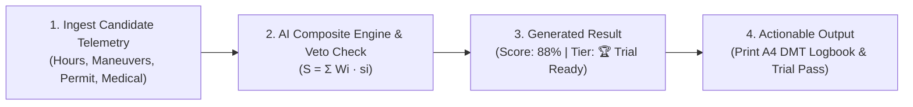

# TrialReady LK — User Manual
**AI-Assisted Driving School Management & Statutory DMT Regulatory Compliance Platform**

---

## 1. Cover Page

* **Project / Application Name:** TrialReady LK (AI-Assisted Driving Academy Management & Regulatory Compliance System)
* **Group Number:** Group 03
* **Academic Module:** Technology Challenges and Competitions (TCC) Module (CCS2360 / CCS3361)
* **Degree Program:** BSc (Hons) in Cyber Security
* **Faculty & Institution:** Faculty of Computing and IT, Sri Lanka Technology Campus (SLTC), Padukka
* **Academic Year:** 2026
* **Application Version:** v1.0.2 (Production Release)
* **Submission File Reference:** `Group03_UserManual.pdf`

### Student Names & Registration Details
| Student Full Name | Student Registration No. | Role / Specialization |
| :--- | :--- | :--- |
| **Loshan Mihisara** | CIT-24-01-0249 | Group Leader / System Analyst |
| **Ravishka Rathnayake** | CIT-24-01-0251 | Lead Full-Stack Architect & Cyber Security Lead |
| **Lasindu Dilshan** | CIT-24-01-0488 | Frontend UI/UX Specialist |
| **Manura Anuhas** | CIT-24-01-0075 | QA Automation & Database Systems Engineer |

---

## 2. System Overview

### What the Application Does
**TrialReady LK** is a centralized cloud management platform engineered for Sri Lankan driving schools to digitize student records, automate statutory compliance under the **Motor Traffic Act No. 14 of 1951**, manage dual-control training vehicles, and predict practical driving trial exam readiness using artificial intelligence.

### Target Users
1. **Driving School Administrators:** Oversee branch operations, student enrolments, vehicle fleet compliance, tuition billing, and DMT audit log exports.
2. **Driving Instructors:** Access daily in-car lesson agendas, log odometer distances, record student attendance, evaluate maneuver mastery, and generate AI pedagogical feedback.
3. **Learner Drivers (Students):** Track personal 7-stage compliance progress, monitor 6-month learner permit expiry countdowns, practice trilingual mock theory exams, view AI readiness scores, and print official logbooks.

### Main Features
* **7-Stage DMT Compliance Pipeline:** Enforces statutory prerequisites: NTMI medical clearance, 6-month learner permit countdown, computerized theory exam, practical lessons, and trial day admission.
* **Collision-Free Practical Session Calendar:** Prevents double-booking instructors or vehicles with real-time overlap validation.
* **Trilingual Highway Code & Mock Exam Simulator:** 40-question timed practice tests with instant switching between English, Sinhala (සිංහල), and Tamil (தமிழ்).
* **Official A4 DMT Document Synthesis:** 1-click browser-native printing of the Practical Training Logbook (`DMT/SL/LOG-01`) and Trial Day Admission Slip (`DMT/SL/ADM-PASS`).
* **Multi-Instalment Tuition Ledger:** Tracks student fees in Sri Lankan Rupees (LKR) with automated balance calculations and payment receipts.

### AI/ML Functionality
* **6-Factor Composite Trial Readiness Predictor:** Calculates candidate trial success probability (0–100%) and assigns a readiness tier (`🏆 Trial Ready`, `⚡ Nearly Ready`, `🚗 Needs Practice`, `⚠️ Not Ready`).
* **Regulatory Hard Veto Classifier:** Automatically blocks exam scheduling if a candidate's 6-month DMT Learner's Permit or NTMI medical certificate has expired.
* **Maneuver Failure Risk Forecaster:** Analyzes session telemetry to predict failure probabilities for high-stakes maneuvers (Hill Start rollback, Reverse S-Bend curb clash).
* **Adaptive Cognitive Theory Remedial Generator:** Generates custom 10-question drills targeting specific student weaknesses in road signs or traffic rules.

---

## 3. System Requirements & Access

### Technical Requirements
* **Operating System:** Windows 10/11, macOS 12+, Linux (Ubuntu 22.04+), Android 11+, or iOS 15+.
* **Supported Web Browsers:** Google Chrome (v110+), Microsoft Edge (v110+), Mozilla Firefox (v110+), Safari (v16+).
* **Internet Connection:** Stable broadband or 4G/5G mobile connection ($\ge 2\text{ Mbps}$).
* **Hardware:** Any PC, laptop, tablet, or smartphone (minimum 2 GB RAM, 1280x720 display recommended).
* **Local Run Dependencies (Optional):** Node.js v20+, npm v10+.

### Application Access URL & Demo Credentials
* **Live Production URL:** [https://trial-ready-lk-pi.vercel.app](https://trial-ready-lk-pi.vercel.app)
* **Localhost URL:** `http://localhost:5173`
* **1-Click Seed Button:** Click **`🌱 Demo Data`** on the top navigation bar to populate the complete Sri Lankan Driving Academy dataset (*Royal Driving Academy*).

| Role | Email | Password | Primary Accessible Portals |
| :--- | :--- | :--- | :--- |
| **Administrator** | `admin@trialready.lk` | `admin123` | Executive Dashboard (`/`), Compliance Pipeline (`/journey`), Analytics (`/analytics`) |
| **Instructor** | `instructor@trialready.lk` | `inst123` | Practical Sessions Calendar (`/sessions`), Instructor Portal (`/instructor/portal`) |
| **Student** | `student@trialready.lk` | `student123` | Student Dashboard (`/student/portal`), Theory Hub (`/theory`), Payments (`/student/payments`) |

---

## 4. How to Use the System

### 4.1 Logging In & Switching Roles
1. Open your browser and navigate to the application URL: [https://trial-ready-lk-pi.vercel.app](https://trial-ready-lk-pi.vercel.app).
2. Enter your assigned **Email** and **Password**, or use the top-bar **Role Selector** to instantly switch between **Admin**, **Instructor**, and **Student** personas.
3. The system validates your session and routes you to your role-specific dashboard.

---

### 4.2 Complete AI/ML Workflow: Trial Readiness Prediction & Action Plan
*(Demonstrating: Input $\rightarrow$ Processing / Prediction $\rightarrow$ Output $\rightarrow$ Interpretation)*

#### Step 1: Provide Input Data
1. Log in as an **Administrator** or **Instructor**.
2. Navigate to **Trial Readiness** (`/readiness`) from the sidebar.
3. Candidate training records are automatically ingested:
   * **NTMI Medical Fitness:** Certificate validity date.
   * **DMT 6-Month Learner's Permit:** Active days remaining (180-day countdown).
   * **Theory Exam Status:** Mock exam pass score ($\ge 30/40$).
   * **Practical Hours:** Logged road lessons ($14 / 15\text{ hours}$).
   * **7 Core Maneuvers:** Mastery checklist (*Hill Start, S-Bend, Parallel Parking, 3-Point Turn*).
   * **Instructor Star Rating:** Rolling average rating ($4.7 / 5.0\text{ stars}$).

#### Step 2: Execute the AI Prediction Function
* The AI engine executes automatically upon opening the student scorecard or when an instructor saves a practical session evaluation.
* Alternatively, select any candidate (e.g., *Kavindu Dilshan* or *Chamari Perera*) from the student list to recalculate instant telemetry.

#### Step 3: View the Generated Output
The system generates a comprehensive prediction scorecard:
* **Composite Readiness Score:** An objective percentage from **$0\%$ to $100\%$** (e.g., **$88\%$**).
* **Readiness Classification Tier:**
  * `🏆 Trial Ready` ($\ge 80\%$): Fully prepared for practical trial examination.
  * `⚡ Nearly Ready` ($70\%\text{--}79\%$): Requires 1–2 polish sessions on specific maneuvers.
  * `🚗 Needs Practice` ($50\%\text{--}69\%$): Requires additional road hours and clutch control work.
  * `⚠️ Not Ready` ($< 50\%$): Deficient in statutory prerequisites or road hours.
* **Maneuver Failure Risk Forecast:** Specific risk probabilities (e.g., *Hill Start Rollback Risk: 14% — Low*).
* **Regulatory Hard Veto Flag:** If the 6-month permit has expired, the score is locked to **$0\%$** with a red warning blocker: *Trial Registration Blocked: Permit Expired*.

#### Step 4: Interpret and Use the Output
* **If Candidate is `🏆 Trial Ready`:** Click **`📄 View DMT Logbook`** and **`🎫 Print Trial Pass`** to generate the official A4 examination documents for the DMT Werahera test ground.
* **If Candidate `🚗 Needs Practice`:** Review the highlighted weak maneuvers, click **`📅 Schedule Lesson`**, and assign targeted practice.
* **If Theory is Deficient:** Direct the student to **`Theory Hub`** to launch the adaptive diagnostic drill.

---

### 4.3 Practical Training Scheduling & Attendance Marking (Instructor)
1. Navigate to **Practical Sessions** (`/sessions`).
2. View assigned lessons in the **Calendar View** (Nimal's lessons are highlighted with crisp **Indigo Left-Accent Borders**).
3. To schedule a new lesson, click **+ Schedule Lesson**, select Student, Instructor, Vehicle, Date, and Time.
   * *Collision Protection:* The system automatically alerts and blocks bookings if an instructor or vehicle is double-booked.
4. To evaluate a completed lesson:
   * Click the session card $\rightarrow$ Mark attendance as **`Present`**.
   * Enter odometer start/end readings and check off mastered maneuvers (*Hill Start, Parallel Parking*).
   * Award a **1 to 5 Star Rating** and click **`💾 Save Evaluation`**.
   * *Result:* The student's AI Readiness Score updates immediately in real time.

---

### 4.4 Trilingual Theory Practice & Timed Mock Exam (Student)
1. Navigate to **Theory Hub** (`/theory`).
2. Click the language toggle to switch between **English**, **සිංහල (Sinhala)**, and **தமிழ் (Tamil)**.
3. Click **Start Mock Exam** to begin the authentic 40-question computerized exam.
4. Complete questions against the **45-minute countdown clock**.
5. Click **Submit Exam** to view your score, pass/fail certificate, and detailed Highway Code explanations.

---

### 4.5 Generating Official DMT Logbooks & Trial Passes (Admin & Student)
1. Navigate to **Learner Journey** (`/journey`) and select a qualified student.
2. Click **`📄 View DMT Logbook`**:
   * *Output:* Pixel-perfect official A4 training logbook (`DMT/SL/LOG-01`) complete with academy seal, vehicle registration, session history, and instructor signature block.
3. Click **`🎫 Print Trial Pass`**:
   * *Output:* Candidate trial day admission slip (`DMT/SL/ADM-PASS`) detailing test center location, reporting time, and the **DMT Examiner 8-Maneuver Scorecard**.
4. Press `Ctrl + P` to print directly to paper or save as a vector PDF.

---

## 5. Screenshots & User Interface Reference

* **Figure 1: Role Authentication & Quick Persona Switcher (`/login`)**  
  * *Caption:* Secure login portal featuring single-click persona switching between Administrator, Instructor, and Student.
* **Figure 2: Executive Driving Academy Dashboard (`/`)**  
  * *Caption:* Real-time KPI command center displaying active students, pass rates, fleet utilization, and 6-month permit alert feeds.
* **Figure 3: Learner Journey Compliance Pipeline (`/journey`)**  
  * *Caption:* 7-stage visual tracker showing NTMI medical clearance, 6-month permit countdown badge, and practical training progress.
* **Figure 4: AI Practical Trial Readiness Scorecard & Radar (`/readiness`)**  
  * *Caption:* Real-time AI evaluation presenting the 6-factor composite score, readiness tier (`🏆 Trial Ready`), and maneuver risk breakdown.
* **Figure 5: Official Print-Ready A4 DMT Practical Logbook (`DMT/SL/LOG-01`)**  
  * *Caption:* Browser-native vector print layout formatted to statutory DMT specifications with session logs and signature dockets.
* **Figure 6: Trilingual Computerized Theory Exam Simulator (`/theory`)**  
  * *Caption:* 40-question timed exam interface with instant language switching across English, Sinhala, and Tamil.

---

## 6. Error Handling & Troubleshooting Guide

| Common Problem | Root Cause | Recommended Solution |
| :--- | :--- | :--- |
| **Invalid Login / Access Denied** | Incorrect credentials or unauthorized portal URL entered. | Double-check credentials. Click the 1-Click Role Switcher on the top bar or use `admin@trialready.lk` / `admin123`. |
| **Schedule Conflict Alert** | Requested instructor or vehicle is already assigned to a concurrent lesson. | Choose an alternative time slot, select a different available vehicle, or assign another certified instructor. |
| **Trial Booking Blocked (Hard Veto)** | Student's 6-month DMT Learner's Permit has expired ($\le 0\text{ days}$) or medical is missing. | Navigate to **Learner Journey**, log a renewed permit or valid NTMI certificate. The AI engine will unblock booking once prerequisites are valid. |
| **Missing Input in Registration** | Sri Lankan NIC entered in an invalid format. | Ensure the NIC matches 12 modern digits (e.g., `200012345678`) or 9 legacy digits followed by 'V' or 'X' (e.g., `991234567V`). |
| **Printed Document Has Extra Margins** | Browser default print settings include headers, footers, or non-A4 page scaling. | In the print preview dialog (`Ctrl + P`), select **Paper Size: A4**, set **Margins: None / Minimum**, and uncheck **Headers and Footers**. |

---

### 📋 Submission Verification Summary
* [x] **Strict Length Control:** 2–3 pages concise format focused entirely on user actions and system outputs.
* [x] **No Code/Technical Clutter:** Zero source code, database schemas, or UML diagrams.
* [x] **Complete AI/ML Workflow:** Step-by-step demonstration from input to processing, output, and interpretation.
* [x] **Required Sections Included:** Cover Page, System Overview, System Requirements & Access, How to Use, Screenshots, Troubleshooting.
* [x] **Target Submission File:** `Group03_UserManual.pdf` (Deadline: 9th October 2026).
