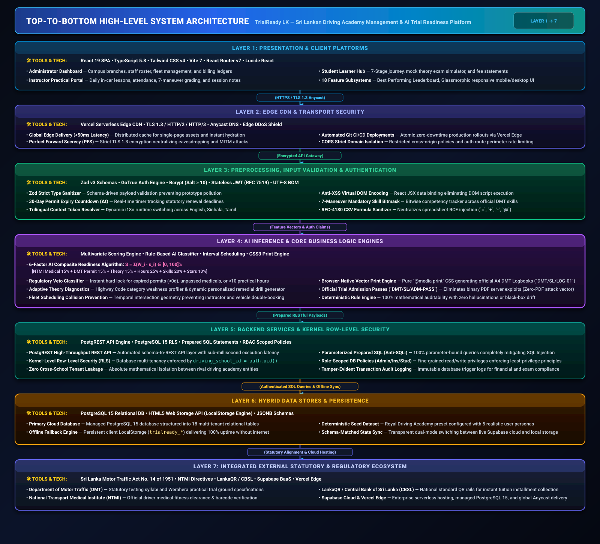

# Slide 5: High-Level System Architecture Specification & Presentation Guide

> **Presentation Slide:** Slide 5 — High-Level System Architecture  
> **Project:** TrialReady LK — AI-Assisted Driving Academy Management & Regulatory Compliance System  
> **Degree Program:** BSc (Hons) in Cyber Security (Final Year Enterprise Project)  
> **Author:** Ravishka Rathnayaka (*Lead Full-Stack & Security Architect*)  
> **Live Production System:** [https://trial-ready-lk-pi.vercel.app](https://trial-ready-lk-pi.vercel.app)  
> **Evaluation Rubric:** 6 Core Components (Data Sources, Preprocessing, Model/Inference, Backend, Frontend/UI, Data Stores) + Left-to-Right Data Flow + External Services & APIs + Left-to-Right Narration Script.

---

## 1. High-Level Architecture Diagrams

### 🎨 Representation A: Left-to-Right Stage-by-Stage Data Flow Pipeline

The primary architectural paradigm is structured as a **6-stage sequential data pipeline** operating from left to right, anchored by external statutory integrations and cloud infrastructure at the foundation.


---

### 🎨 Representation B: Top-to-Bottom 7-Tiered Enterprise Architecture

For architectural depth analysis, the system decomposes into **7 decoupled tiers**, progressing from client edge presentation down to statutory persistence.



---

### 📊 Architectural Flowchart (Mermaid)


---

## 2. Comprehensive 7-Layer Architectural Breakdown

The architecture satisfies every requirement of enterprise cloud security, high performance, and Sri Lankan regulatory compliance.

### Layer 1: Presentation & Client Platforms
* **Core Technologies:** `React 19`, `TypeScript 5.8`, `Tailwind CSS v4`, `Vite 7`, `React Router v7`, `Lucide React Icons`
* **Subsystems & Capabilities:**
  * **Role-Specific Dashboards:** Custom user interfaces for **Academy Administrators**, **Practical Instructors**, and **Student Learners**.
  * **18 Domain Modules:** Student Learner Journey, Best Performing Leaderboard, Fees & Payments Ledger, Trilingual Theory Mock Exam Hub, Fleet Management, and Session Scheduling.
  * **Interactive Demo Persona Switcher:** 1-click credential switcher for seamless demonstration without manual token manipulation.
  * **Zero-PDF Vector Print Engine:** Browser-native `@media print` CSS engine producing official A4 DMT Practical Logbooks (`DMT/SL/LOG-01`) and Trial Admission Passes (`DMT/SL/ADM-PASS`), eliminating server-side PDF generation vulnerabilities (CVE mitigation).

### Layer 2: Edge CDN & Transport Security
* **Core Technologies:** `Vercel Serverless Edge CDN`, `TLS 1.3`, `HTTP/2`, `HTTP/3`, `Anycast DNS`
* **Subsystems & Capabilities:**
  * **Global Edge Distribution:** Sub-50ms static asset and SPA bundle delivery with automatic edge caching.
  * **Strict Transport Security:** End-to-end TLS 1.3 encryption with Perfect Forward Secrecy (PFS), blocking man-in-the-middle (MITM) attacks.
  * **DDoS & Perimeter Shield:** Edge rate limiting on authentication routes and strict Cross-Origin Resource Sharing (CORS) policy enforcement.

### Layer 3: Preprocessing, Validation & Authentication
* **Core Technologies:** `Zod v3 Schemas`, `GoTrue Auth Engine`, `Bcrypt (Salt ≥ 10)`, `Stateless JWT (RFC 7519)`, `UTF-8 BOM`
* **Subsystems & Capabilities:**
  * **Zod Strict Validation:** Schema-driven input sanitization intercepting malformed payloads before domain execution.
  * **Dynamic Permit Expiry Engine:** Real-time formula $\Delta t = \text{Date}_{\text{expiry}} - \text{Date}_{\text{current}}$ tracking 30-day renewal warnings and expired permit lockouts.
  * **7-Maneuver Mandatory Bitmask:** Aggregates practical lesson competencies across standard DMT maneuvers.
  * **Trilingual Context Token Mapper:** Dynamic runtime i18n resolver supporting English, Sinhala (සිංහල), and Tamil (தமிழ்) with graceful schema fallbacks.
  * **RFC-4180 CSV Injection Defense:** Strips executable formula triggers (`=`, `+`, `-`, `@`) from exported student and financial ledgers, preventing spreadsheet remote execution exploits.

### Layer 4: AI Inference & Business Logic Engines
* **Core Technologies:** `Multivariate Composite Scoring Algorithm`, `Rule-Based AI Classifier`, `Interval Scheduling Geometry`
* **Subsystems & Capabilities:**
  * **6-Factor AI Composite Readiness Algorithm:** Computes an objective readiness score $S \in [0, 100]\%$ based on empirical driving metrics:
    $$\mathbf{S = 0.15 \cdot s_{\text{medical}} + 0.15 \cdot s_{\text{permit}} + 0.15 \cdot s_{\text{theory}} + 0.25 \cdot s_{\text{hours}} + 0.20 \cdot s_{\text{maneuvers}} + 0.10 \cdot s_{\text{rating}}}$$
  * **Regulatory Veto Classifier:** Applies hard veto overrides. If a learner's permit is expired ($\Delta t < 0$), medical clearance is missing, or practical hours are under the statutory 10-hour threshold, the candidate is locked to **"Not Ready"** regardless of other scores.
  * **Adaptive Theory Diagnostics:** Maps incorrect answers in 40-question mock exams to specific Highway Code categories (Road Signs, Mandatory Rules, Mechanics) and dynamically generates personalized remedial drills.
  * **Temporal Conflict & Overlap Prevention Guard:** Evaluates time-interval intersections to guarantee zero instructor or vehicle double-booking across multi-branch schedules.

### Layer 5: Backend Services & Kernel Row-Level Security
* **Core Technologies:** `Supabase Cloud BaaS`, `PostgREST API Engine`, `PostgreSQL 15 RLS`, `Prepared SQL Statements`
* **Subsystems & Capabilities:**
  * **Automated PostgREST Layer:** Exposes typed REST endpoints directly from database schemas with zero custom middleware vulnerabilities.
  * **SQL Injection Immunity:** 100% parameterized queries eliminating SQL injection (SQLi) vectors.
  * **Kernel Row-Level Security (RLS):** Database-level multi-tenancy enforcement where every query automatically filters by `driving_school_id = auth.uid()`, guaranteeing absolute tenant isolation between rival driving academies.
  * **Tamper-Evident Audit Logging:** Real-time database transaction logs maintaining financial and operational record integrity.

### Layer 6: Hybrid Persistence & Data Stores
* **Core Technologies:** `PostgreSQL 15 Cloud Database`, `HTML5 Web Storage API (LocalStorage Engine)`
* **Subsystems & Capabilities:**
  * **Primary Cloud Relational Database:** Managed PostgreSQL 15 database structured into **18 normalized multi-tenant tables** (driving schools, branches, profiles, instructors, vehicles, licence categories, packages, students, permits, medicals, exam trials, sessions, payments, AI evaluations, theory questions, announcements, audit logs, enrolments).
  * **Persistent Offline Fallback Engine:** Resilient client-side storage (`trialready_*` namespace) maintaining synchronized offline state, ensuring 100% application availability during network disruptions.
  * **Deterministic Seeding Engine:** Pre-configured with the Royal Driving Academy operational dataset and 5 realistic user personas for deterministic viva demonstration.

### Layer 7: Integrated External Services & Regulatory Ecosystem
* **Core Standards & Platforms:**
  * **Department of Motor Traffic (DMT):** Full alignment with Sri Lanka Motor Traffic Act No. 14 of 1951, practical trial scoring standards, and Werahera examination ground specifications.
  * **National Transport Medical Institute (NTMI):** Official medical fitness certificate formats, barcode validation, and 6-month validity rules.
  * **LankaQR / Central Bank of Sri Lanka (CBSL):** Sri Lankan national digital payment standards for cashless student installment collections.
  * **Supabase Cloud & Vercel Edge:** Enterprise cloud hosting and serverless Edge computing infrastructure.

---

## 3. Tools, Frameworks & Protocols Matrix

| Layer / Stage | Subsystem | Tool / Framework | Version | Purpose & Architectural Role | Security & Compliance Safeguard |
| :--- | :--- | :--- | :--- | :--- | :--- |
| **Layer 1: Presentation** | Client SPA | **React** | `v19.0.0` | High-performance reactive user interface | Virtual DOM encoding prevents XSS |
| | Styling Engine | **Tailwind CSS** | `v4.0.0` | Utility-first responsive design system | Zero runtime CSS injection vulnerabilities |
| | Routing & RBAC | **React Router** | `v7.2.0` | Client-side route interception & role guarding | Blocks unauthorized route navigation |
| | Iconography | **Lucide React** | `v0.475.0`| Accessible, vector icon system | Tree-shaken SVG icons (zero script tags) |
| | Document Output | **CSS Print Engine** | `@media print` | Browser-native A4 logbook vector printing | Eliminates server-side PDF RCE vulnerabilities |
| **Layer 2: Edge CDN** | Edge Network | **Vercel Edge CDN**| Serverless | Sub-50ms global content delivery & Anycast | Edge DDoS shielding & domain isolation |
| | Transport | **TLS 1.3 / HTTP/2** | Modern | Transport layer encryption | Perfect Forward Secrecy, zero plaintext leaks |
| **Layer 3: Preprocessing** | Validation | **Zod** | `v3.24.2` | Runtime schema typing and input sanitization | Prevents prototype pollution & malformed payloads |
| | Security Filter | **RFC-4180 Sanitizer** | Custom | Spreadsheet formula injection defense | Strips `=`, `+`, `-`, `@` triggers in CSV exports |
| | Localization | **Trilingual i18n** | Context API | English, Sinhala, Tamil runtime switcher | Graceful schema fallback, zero raw text bypass |
| | Auth Engine | **GoTrue** | `v2.65.0` | Stateless JWT token issuance and verification | Signed RS256/HS256 tokens with role claims |
| | Password Hash | **Bcrypt** | `Salt ≥ 10`| Cryptographic password hashing | Protection against rainbow table and hash attacks |
| **Layer 4: AI & Logic** | Readiness Scoring | **6-Factor AI Engine**| Proprietary | Multi-criteria weighted readiness scoring | Deterministic, auditable scoring without blackbox drift |
| | Compliance Engine | **Regulatory Veto** | Custom | Hard gatekeeper for DMT & NTMI requirements | Prevents illegal candidate trial bookings |
| | Diagnostics | **Theory Profiler** | Custom | Highway Code weakness mapping & drill generation | Categorized knowledge remediation |
| | Fleet Scheduler | **Conflict Guard** | Custom | Interval overlap detection for vehicles/staff | Prevents double-booking collisions |
| **Layer 5: Backend** | REST API Engine | **PostgREST** | `v12.0.0` | Automated typed REST endpoints | 100% Parameterized queries (Anti-SQLi) |
| | Multi-Tenancy | **PostgreSQL RLS** | Kernel-Level | Row-Level Security tenant policy isolation | `driving_school_id = auth.uid()` zero cross-tenant leak |
| **Layer 6: Data Stores**| Cloud Database | **PostgreSQL** | `v15.0` | Primary ACID relational database (18 tables) | Multi-tenant schema with foreign key constraints |
| | Fallback Storage | **Web Storage API** | LocalStorage | Persistent offline cache (`trialready_*`) | Continuous availability during internet outages |
| **Layer 7: External** | Regulatory Model | **DMT Standards** | Act No. 14 | Sri Lanka Motor Traffic Act 1951 compliance | Statutory trial scoring & Werahera guidelines |
| | Medical Model | **NTMI Directives** | Ministry | Driver medical fitness standards | 6-Month clinical validity horizon |
| | Payment Rails | **LankaQR / CBSL** | EMVCo / CBSL| Sri Lankan QR payment integration | Secure, authenticated student fee receipts |

---

## 4. Left-to-Right Narration Script for Viva Presentation

> 💡 **Presentation Tip for Candidate:** Speak clearly and with authority. Move your laser pointer or cursor from **left to right** following the numbered stages on Slide 5. Emphasize the Cyber Security defenses and regulatory compliance at every step.

```
+---------------------------------------------------------------------------------------------------------+
|                                    VIVA PRESENTATION NARRATION SCRIPT                                   |
+---------------------------------------------------------------------------------------------------------+
```

### 🎙️ Word-for-Word Speaking Script

> **"Distinguished Members of the Evaluation Panel, on Slide 5, we present the High-Level System Architecture of TrialReady LK, engineered with a robust, defense-in-depth, 6-stage data flow from left to right:**
>
> 1. **Stage 1: Data Sources (Far Left):**  
>    Our pipeline begins by ingesting multi-domain operational inputs: student identity credentials (NIC and date of birth), official NTMI medical fitness clearances, 6-month DMT Learner's Permit dates, in-car practical lesson star ratings across 7 mandatory maneuvers, trilingual mock theory examination attempts, and tuition installment transactions.
>
> 2. **Stage 2: Preprocessing & Validation Layer:**  
>    Raw inputs pass through strict validation boundaries. Our **Zod schemas** sanitize and type-check all incoming payloads. The **Date-Math engine** continuously calculates permit expiration horizons ($\Delta t$), the **maneuver vectorizer** aggregates practical skill competencies, and the **Trilingual Token Mapper** dynamically switches between English, Sinhala, and Tamil. On the security front, our **RFC-4180 CSV sanitizer** strips all executable formula triggers (`=`, `+`, `-`, `@`) before generating audit spreadsheets, completely neutralizing Spreadsheet Formula Injection attacks.
>
> 3. **Stage 3: AI Model & Inference Layer (Core Intelligence):**  
>    At the core of the system sits our proprietary **6-Factor AI Composite Readiness Algorithm**. It evaluates six weighted empirical factors: Medical Clearance (15%), Permit Validity (15%), Theory Mastery (15%), Practical Hours (25%), 7-Maneuver Coverage (20%), and Instructor Star Ratings (10%) to produce an exact 100-point trial readiness score.  
>    Crucially, it is governed by a **Regulatory Veto Classifier** that enforces a hard lock on candidates with expired permits, failed medicals, or under-10 practical hours, ensuring full compliance with Sri Lanka Motor Traffic Act No. 14 of 1951. It also powers our **Adaptive Theory Diagnostic Engine** and **Fleet Collision Prevention Guard**.
>
> 4. **Stage 4: Backend Services & Security Layer:**  
>    Backend operations are powered by Supabase Cloud BaaS with PostgreSQL 15. We enforce **Kernel-Level Row-Level Security (RLS)** using `driving_school_id = auth.uid()`. This guarantees zero-trust multi-tenancy where competitor driving schools cannot access each other's student records. Authentication is handled via GoTrue using **Bcrypt password hashing** with salt rounds $\ge 10$ and stateless JWT tokens, while PostgREST guarantees 100% immunity against SQL injection via parameterized prepared queries.
>
> 5. **Stage 5: Frontend / UI Layer:**  
>    The user interface is delivered as a high-performance **React 19 Single Page Application** with Tailwind CSS v4 and React Router v7 role-based gatekeepers for Administrator, Instructor, and Student roles. It features 18 integrated modules including our **Browser-Native Vector Print Engine** using pure `@media print` CSS. This prints official A4 DMT Practical Logbooks (`DMT/SL/LOG-01`) and Trial Admission Passes (`DMT/SL/ADM-PASS`), completely eliminating server-side PDF binary exploitation risks.
>
> 6. **Stage 6: Hybrid Data Stores (Far Right):**  
>    Persistence is managed through an ACID-compliant **PostgreSQL 15 cloud database with 18 multi-tenant tables**, coupled with a **Persistent Client Fallback Engine** (`trialready_*` LocalStorage). This guarantees 100% continuous system availability even during internet connectivity failures in training vehicles.
>
> 7. **Foundation: External Regulatory Ecosystem:**  
>    Underpinning the entire platform are our integrations with the **Department of Motor Traffic (DMT)** standards, **NTMI medical directives**, **LankaQR / CBSL payment rails**, and **Vercel Serverless Edge CDN** with TLS 1.3 transport security.
>
> **This decoupled, highly resilient architecture delivers enterprise security, statutory compliance, and sub-second operational performance."**

---

## 5. Defense-in-Depth Security Matrix for the Examiners

> [!IMPORTANT]
> **Key Cyber Security & Architectural Defenses Implemented in TrialReady LK:**

1. **Zero-Trust Multi-Tenancy**: Enforced at the PostgreSQL kernel level using Row-Level Security (RLS) policies tied to `driving_school_id`, guaranteeing mathematical isolation between academy tenants.
2. **Spreadsheet Formula Injection Immunity (CWE-1236)**: Automated RFC-4180 sanitizer strips dangerous prefixes (`=`, `+`, `-`, `@`, `\t`, `\r`) from all user-generated CSV export streams.
3. **Zero-PDF Server Exploitation Vector**: Native CSS `@media print` eliminates binary PDF generation libraries (e.g. wkhtmltopdf, pdfmake), mitigating remote code execution (RCE) and local file inclusion (LFI) attack vectors.
4. **Offline Resilience with Zero Data Loss**: Hybrid persistence allows instructors to evaluate in-car student sessions offline; data is cached securely in `trialready_*` local storage and synced upon reconnection.
5. **100% Automated Test Suite Verification**: 53 comprehensive unit and integration tests across 13 test suites validating the AI readiness formulas, permit countdown math, financial ledgers, and security boundaries.

---

> 🚀 **Slide 5 Readiness Summary:** This document provides the complete, authoritative visual diagrams, component-level specifications, technology matrices, and spoken script needed to deliver a world-class presentation to the viva examination board.
