# Slide 5: High-Level System Architecture Specification & Presentation Guide

> **Presentation Slide:** Slide 5 — High-Level System Architecture  
> **Project:** TrialReady LK — AI-Assisted Driving Academy Management & Regulatory Compliance System  
> **Degree Program:** BSc (Hons) in Cyber Security (Final Year Enterprise Project)  
> **Author:** Ravishka Rathnayaka (*Lead Full-Stack & Security Architect*)  
> **Presentation Rubric:** 6 Core Components (Data Sources, Preprocessing, Model/Inference, Backend, Frontend/UI, Data Stores) + Left-to-Right Flow + External Services & APIs + Left-to-Right Narration Script.

---

## 1. High-Level Architecture Diagram (Left-to-Right Flow)

```mermaid
flowchart LR
    %% =========================================================================
    %% SLIDE 5: HIGH-LEVEL SYSTEM ARCHITECTURE (LEFT-TO-RIGHT DATA FLOW)
    %% =========================================================================

    subgraph DS["1. DATA SOURCES"]
        direction TB
        DS1["🧑‍🎓 Student Enrolments<br/>• NIC & DOB Verification<br/>• Contact & Residential Data"]
        DS2["🏥 NTMI Medical Records<br/>• Clinical Fitness Certificate<br/>• Barcode & Clinic Branch"]
        DS3["📜 DMT Learner Permits<br/>• 6-Month Permit No<br/>• Issue & Expiry Timestamps"]
        DS4["🚗 Practical Sessions<br/>• 1-5★ Instructor Star Ratings<br/>• 7 Core Maneuvers Covered"]
        DS5["📝 Mock Theory Exams<br/>• 40-Q Trilingual Submissions<br/>• Time Elapsed & Category Scores"]
        DS6["💳 Financial Transactions<br/>• Bank Slip / LankaQR / Card<br/>• Fee Package Subscriptions"]
    end

    subgraph PP["2. PREPROCESSING LAYER"]
        direction TB
        PP1["⚙️ Input Validator & Zod Schema<br/>• Type Sanitization<br/>• Anti-XSS DOM Encoding"]
        PP2["⏱️ Permit Expiry Countdown<br/>• Δt = Expiry - Current<br/>• 30-Day Warning Engine"]
        PP3["🎯 Maneuver Vectorizer<br/>• 7-Skill Bitmask Aggregator<br/>• Practical Hours Summation"]
        PP4["🌐 Trilingual Token Mapper<br/>• Locale Fallback (EN/SI/TA)<br/>• Question Bank Loader"]
        PP5["🛡️ RFC-4180 CSV Sanitizer<br/>• Formula Injection Defense<br/>• UTF-8 Excel BOM Encoding"]
    end

    subgraph ML["3. MODEL & INFERENCE LAYER"]
        direction TB
        ML1["🧠 6-Factor AI Readiness Engine<br/>• Composite Score: S = Σ(Wi · si)<br/>• Medical(15%) + Permit(15%) + Theory(15%)<br/>  + Hours(25%) + Maneuvers(20%) + Rating(10%)"]
        ML2["🚫 Regulatory Veto Classifier<br/>• Critical Blocker Detection<br/>• Hard Lock for Expired Permits"]
        ML3["📊 Adaptive Diagnostic Engine<br/>• Category Weakness Profiling<br/>• Targeted Remedial Drill Gen"]
        ML4["📅 Scheduling Conflict Engine<br/>• Temporal Intersection Filter<br/>• Instructor/Fleet Double-Book Guard"]
    end

    subgraph BE["4. BACKEND LAYER"]
        direction TB
        BE1["🔐 GoTrue Auth Engine<br/>• JWT Stateless Token Issuance<br/>• Bcrypt Password Hashing (Salt≥10)"]
        BE2["⚡ PostgREST Automated API<br/>• Parameterized Prepared Queries<br/>• Instant REST CRUD Endpoints"]
        BE3["🛡️ Row-Level Security (RLS)<br/>• Kernel-Level Multi-Tenancy<br/>• Tenant ID Driving School Filter"]
    end

    subgraph FE["5. FRONTEND / UI LAYER"]
        direction TB
        FE1["💻 React 19 SPA + Tailwind v4<br/>• Lucide React Icon System<br/>• Responsive Glassmorphic UI"]
        FE2["🚦 React Router v7 Gatekeeper<br/>• RBAC: Admin, Instructor, Student<br/>• Protected Route Interceptors"]
        FE3["📱 18 Integrated Domain Modules<br/>• Admin, Instructor, Student Portals<br/>• Trilingual Theory Hub & 40-Q Exam<br/>• Payments, Sessions, & Analytics"]
        FE4["🖨️ Vector Print Engine (@media print)<br/>• Official DMT Logbook (DMT/SL/LOG-01)<br/>• Trial Admission Slip (DMT/SL/ADM-PASS)"]
    end

    subgraph ST["6. DATA STORES"]
        direction TB
        ST1["🗄️ Primary Cloud Database<br/>• Supabase PostgreSQL 15<br/>• 18 Multi-Tenant Relational Tables<br/>• Foreign Key Cascades & Constraints"]
        ST2["💾 Persistent Client Fallback Cache<br/>• LocalStorage (trialready_*)<br/>• Deterministic Seed & Offline State<br/>• Schema-Matched Data Sync"]
    end

    subgraph EXT["7. EXTERNAL SERVICES & APIS"]
        direction TB
        EXT1["☁️ Supabase Cloud (BaaS Infrastructure)"]
        EXT2["🚀 Vercel Edge Serverless CDN"]
        EXT3["🏛️ Dept. of Motor Traffic (DMT Standards)"]
        EXT4["🏥 National Transport Medical Institute (NTMI)"]
        EXT5["💳 LankaQR / Central Bank of Sri Lanka (CBSL)"]
    end

    %% Left-to-Right Connections
    DS -->|1. Ingest Raw Records| PP
    PP -->|2. Normalized Vectors| ML
    ML -->|3. Evaluations & Predictions| BE
    BE <-->|4. Authenticated SQL with RLS| ST
    BE -->|5. RESTful JSON API| FE
    FE -->|6. User Mutations & Queries| BE
    FE <-->|7. Standalone / Offline Fallback| ST2

    EXT1 -.->|BaaS & Auth Hosting| BE
    EXT2 -.->|Edge CDN Delivery| FE
    EXT3 -.->|Statutory Syllabus Alignment| ML
    EXT4 -.->|Medical Protocol Rules| ML
    EXT5 -.->|Payment Standard Integration| FE

    classDef primary fill:#1e293b,stroke:#3b82f6,stroke-width:2px,color:#fff;
    classDef accent fill:#0f172a,stroke:#10b981,stroke-width:2px,color:#fff;
    classDef warning fill:#1e1b4b,stroke:#f59e0b,stroke-width:2px,color:#fff;
    classDef ext fill:#18181b,stroke:#a855f7,stroke-width:2px,color:#fff;
    
    class DS,PP,ML,BE,FE,ST primary;
    class ML accent;
    class BE,ST warning;
    class EXT ext;
```

---

## 2. Component-by-Component Architectural Breakdown

| Stage / Component | Key Subsystems & Responsibilities | Technologies & Protocols |
| :--- | :--- | :--- |
| **1. Data Sources** | • Student registration profiles (NIC, DOB, contact details) • NTMI medical certificate numbers and examination dates • 6-Month DMT Learner's Permit issuance and expiry records • Practical in-car driving lessons with instructor star ratings (1–5) and maneuver checkboxes • Trilingual computerized theory mock examination attempts • Fee payment receipts and course package installments | HTTP Forms, Document Ingestion, Structured JSON Payload |
| **2. Preprocessing Layer** | • Client & Server data validation via Zod schemas and TypeScript interfaces • Dynamic permit expiry calculation ($\Delta t = \text{Date}_{\text{expiry}} - \text{Date}_{\text{current}}$) • 7 mandatory DMT maneuver bitmask aggregation • Trilingual string tokenization and locale fallback (`en` $\leftrightarrow$ `si` $\leftrightarrow$ `ta`) • RFC-4180 CSV formula sanitization (`=`, `+`, `-`, `@`) | TypeScript, Regular Expressions, Date-Math Engine, UTF-8 BOM |
| **3. Model & Inference Layer** | • **6-Factor Weighted AI Readiness Composite Scoring Engine** ($0 - 100\%$ score) • **Regulatory Veto Classifier** enforcing hard blocks for expired permits or missing medicals • **Adaptive Diagnostic Engine** mapping incorrect mock answers to specific Highway Code categories and generating custom remedial quizzes • **Temporal Overlap Collision Detection** preventing instructor and vehicle double-booking | Multivariate Weighted Scoring Algorithm, Rule-Based AI Classifier, Interval Scheduling Geometry |
| **4. Backend Layer** | • GoTrue Authentication Engine managing JWT stateless tokens and session lifetimes • PostgREST automated API layer generating typed REST endpoints • PostgreSQL Row-Level Security (RLS) enforcing multi-tenant isolation per `driving_school_id` | Supabase Cloud BaaS, JWT (HS256/RS256), Bcrypt (Salt $\ge 10$), PostgreSQL RLS |
| **5. Frontend / UI Layer** | • Modern React 19 Single Page Application with Tailwind CSS v4 design system • Protected Route Gatekeeper enforcing Role-Based Access Control (`administrator`, `instructor`, `student`) • 18 modular feature views across portals, sessions, payments, and theory hubs • Zero-dependency Browser-Native Vector Print Engine using pure `@media print` CSS | React 19, TypeScript 5.8, Tailwind CSS v4, Lucide React, React Router v7 |
| **6. Data Stores** | • **Primary Cloud Database**: Managed PostgreSQL 15 with 18 multi-tenant relational tables • **Persistent Client Fallback Engine**: LocalStorage key-value storage (`trialready_*`) providing deterministic offline execution and demo state management | PostgreSQL 15 Relational DB, Web Storage API, Indexed Storage Sync |
| **7. External Services & APIs** | • **Supabase Cloud Infrastructure**: PostgreSQL 15 BaaS, Auth, and Storage • **Vercel Edge Network**: Anycast CDN, HTTP/2, TLS 1.3 hosting • **Department of Motor Traffic (DMT)**: Alignment with official testing syllabi and Werahera trial ground standards • **National Transport Medical Institute (NTMI)**: Driver medical fitness compliance standards • **LankaQR / CBSL**: Sri Lankan national digital payment standards | HTTPS/REST, PostgREST, TLS 1.3, Vercel Edge Serverless CDN |

---

## 3. Left-to-Right Narration Script for the Viva Panel

> *Tip: Present this slide smoothly from left to right following the numbered stages. Speak with confidence and highlight the cyber security and regulatory compliance aspects.*

### 🎙️ Viva Candidate Speaking Script

> **"Distinguished Members of the Evaluation Panel, on Slide 5, we present the High-Level System Architecture of TrialReady LK, engineered with a robust, defense-in-depth, 6-stage data flow from left to right:**
>
> 1. **Data Sources (Far Left):**  
>    The system ingests raw multi-domain inputs: student identity credentials (NIC and date of birth), official NTMI medical clearances, 6-month DMT Learner's Permit dates, in-car instructor star evaluations across 7 core maneuvers, trilingual mock theory test submissions, and tuition installment transactions.
>
> 2. **Preprocessing Layer:**  
>    Raw inputs pass through strict validation layers. Here, our date-math engine calculates permit expiration countdowns, normalizes the 7-maneuver skill matrix, maps trilingual localized tokens across Sinhala, Tamil, and English, and sanitizes outgoing audit records against RFC-4180 CSV Formula Injection attacks.
>
> 3. **Model & Inference Layer (AI Engine):**  
>    At the heart of the system is our **6-Factor AI Trial Readiness Composite Scoring Algorithm**. It computes a weighted 100-point composite score: Medical Clearance (15%), Permit Validity (15%), Theory Mastery (15%), Practical Hours (25%), Maneuver Coverage (20%), and Instructor Rating (10%). It applies a **Regulatory Veto Override** that instantly locks candidates who have expired permits or unpassed medicals. It also runs our **Adaptive Theory Diagnostic Engine** which identifies weak Highway Code categories to generate targeted remedial drills.
>
> 4. **Backend Layer:**  
>    The backend is powered by Supabase Cloud BaaS with PostgreSQL 15. We implement **Kernel-Level Row-Level Security (RLS)**, ensuring multi-tenant isolation where each driving academy can only access its own records. Authentication is managed via GoTrue with Bcrypt password hashing ($\ge 10$ salt rounds) and stateless JWT verification.
>
> 5. **Frontend / UI Layer:**  
>    Delivered as a high-performance React 19 SPA with Tailwind CSS v4 and React Router v7 role gatekeepers for Administrator, Instructor, and Student roles. It features 18 integrated domain modules and a **Browser-Native Vector Print Engine** using pure `@media print` CSS for official A4 DMT Practical Logbooks (`DMT/SL/LOG-01`) and Trial Admission Passes (`DMT/SL/ADM-PASS`), completely eliminating server-side PDF exploitation risks.
>
> 6. **Data Stores (Right):**  
>    Data is stored in PostgreSQL 15 across 18 relational tables, coupled with a hybrid **Persistent Storage Fallback Engine** in the browser, enabling seamless offline capabilities and deterministic demo seeding.
>
> 7. **External Integrations:**  
>    The architecture seamlessly integrates with Supabase Cloud BaaS, Vercel Edge Serverless CDN, and regulatory frameworks set by the Department of Motor Traffic (DMT), NTMI, and LankaQR payment standards.
>
> **This decoupled, highly resilient architecture delivers enterprise security, statutory compliance, and sub-second operational response times."**

---

## 4. Key Defense-in-Depth Highlights for the Examiners

1. **Zero-Trust Multi-Tenancy**: Guaranteed at the database level via PostgreSQL RLS policies tied to `driving_school_id`.
2. **Spreadsheet Formula Injection Defense**: Full sanitization of risky Excel formula triggers (`=`, `+`, `-`, `@`) in CSV audit logs.
3. **Zero-PDF Attack Vector**: Direct CSS vector printing replaces binary PDF libraries, eliminating remote code execution vulnerabilities.
4. **Offline Resiliency**: Hybrid dual-mode persistence architecture allows full offline operation without data loss.
5. **100% Automated Test Pass Rate**: 53 automated tests across 13 test suites validating the AI readiness engine, financial calculations, permit timers, and security boundaries.
