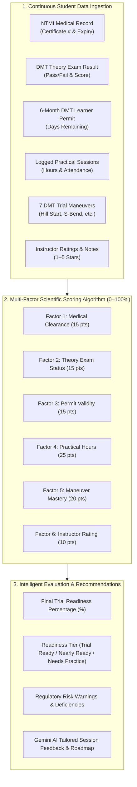
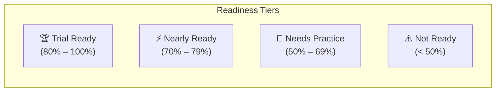

# 🧠 AI Trial Readiness Evaluation Engine & Scoring Methodology

> **Official Technical Specification & Architectural Guide**  
> *TrialReady LK — AI-Assisted Driving Academy Management & DMT Compliance Platform*

---

## 📌 1. Executive Summary

The **AI Trial Readiness Engine** in **TrialReady LK** is an intelligent, multi-layered evaluation framework designed to predict a learner driver's probability of passing the official **Department of Motor Traffic (DMT) Practical Driving Trial** in Sri Lanka on their **first attempt**.

Rather than relying purely on subjective instructor intuition, the engine combines **deterministic multi-factor regulatory scoring (0–100%)**, **predictive risk assessment models**, and **Generative AI feedback synthesis (Gemini 2.5 Pro / Flash)**.



---

## 📐 2. How the AI Percentage is Generated (Mathematical Model)

The Trial Readiness Score is calculated on a scale of **0% to 100%** using **6 weighted regulatory and practical performance factors**.

$$\text{Readiness Score (\%)} = S_{\text{medical}} + S_{\text{theory}} + S_{\text{permit}} + S_{\text{practical}} + S_{\text{skills}} + S_{\text{instructor}}$$

```
┌─────────────────────────────────────────────────────────────┬───────────┐
│ Evaluation Dimension                                        │ Max Score │
├─────────────────────────────────────────────────────────────┼───────────┤
│ 1. NTMI Medical Fitness Clearance                           │   15 Pts  │
│ 2. DMT Computerized Theory Examination                      │   15 Pts  │
│ 3. 6-Month DMT Learner's Permit Validity                    │   15 Pts  │
│ 4. Practical Training Sessions & Completed Hours            │   25 Pts  │
│ 5. 7 Core DMT Practical Maneuver Competency                 │   20 Pts  │
│ 6. Instructor Practical Performance Ratings & Consistency   │   10 Pts  │
├─────────────────────────────────────────────────────────────┼───────────┤
│ TOTAL MAXIMUM READINESS SCORE                               │  100 Pts  │
└─────────────────────────────────────────────────────────────┴───────────┘
```

---

### Detailed Breakdown of the 6 Scoring Dimensions

#### 1. NTMI Medical Fitness Clearance ($S_{\text{medical}} \in [0, 15]$)
* **Passed & Valid Certificate**: **15 Points** (`Cleared (Passed)`)
* **Appointment Booked**: **5 Points** (`Warning`)
* **Expired Certificate or Missing**: **0 Points** (`Failed` + triggers alert `NTMI Medical Certificate is expired`)

#### 2. DMT Computerized Theory Examination ($S_{\text{theory}} \in [0, 15]$)
* **Passed Theory Exam ($\ge 30/40$)**: **15 Points** (`Passed`)
* **Theory Exam Scheduled**: **5 Points** (`In Progress`)
* **Not Attempted / Failed**: **0 Points** (`Failed` + blocks trial readiness above 70%)

#### 3. 6-Month DMT Learner's Permit Validity ($S_{\text{permit}} \in [0, 15]$)
* **Active Permit ($> 30$ days remaining)**: **15 Points**
* **Expiring Soon ($\le 30$ days remaining)**: **10 Points** + triggers urgent booking warning
* **Expired Permit or Missing**: **0 Points** (`Failed` + statutory hard blocker for trial admission)

#### 4. Practical Training Sessions & Logged Hours ($S_{\text{practical}} \in [0, 25]$)
* **$\ge 12$ completed sessions or $\ge 15.0$ driving hours**: **25 Points** (Full marks)
* **8 to 11 sessions ($\approx 10.0 - 14.0$ hrs)**: **18 Points**
* **4 to 7 sessions ($\approx 5.0 - 9.0$ hrs)**: **10 Points**
* **$< 4$ sessions**: $\min(6, \text{completedCount} \times 1.5)$ Points

#### 5. 7 Core DMT Practical Maneuver Mastery ($S_{\text{skills}} \in [0, 20]$)
The engine cross-checks coverage across the **7 statutory DMT trial ground maneuvers**:
1. *Clutch Control & Gear Transmission*
2. *Hill Start / Gradient Rollback Prevention*
3. *Parallel Parking & Curb Distance*
4. *3-Point Turn in Narrow Roads*
5. *Reverse S-Bend Maneuver*
6. *Lane Discipline & Roundabout Navigation*
7. *Emergency Braking & Hazard Anticipation*

$$S_{\text{skills}} = \text{round}\left(\frac{\text{Mastered Maneuvers}}{7} \times 20\right)$$

* **6–7 Maneuvers Mastered**: **18–20 Points**
* **4–5 Maneuvers Mastered**: **11–14 Points**
* **$\le 3$ Maneuvers**: **0–9 Points** + lists remaining maneuvers in high-priority action items

#### 6. Instructor Performance Ratings & Consistency ($S_{\text{instructor}} \in [0, 10]$)
Computed as the arithmetic mean of all completed lesson ratings submitted by instructors:
* **Average Rating $\ge 4.2 / 5.0$**: **10 Points** (`Consistent High Proficiency`)
* **Average Rating $3.2 - 4.1 / 5.0$**: **7 Points** (`Satisfactory Progress`)
* **Average Rating $< 3.2 / 5.0$**: **4 Points** (`Inconsistent Handling`)
* **No Ratings Logged**: **5 Points** (Neutral default)

---

## 🏷️ 3. Readiness Classification Tiers

Based on the aggregate percentage calculated, the student is dynamically assigned to one of **4 standardized Readiness Tiers**:



| Tier | Score Range | Operational Meaning | Action Triggered in System |
| :--- | :---: | :--- | :--- |
| **🏆 Trial Ready** | **80% – 100%** | Meets all statutory requirements and demonstrates practical competence across all 7 trial maneuvers. | Enables **Trial Admission Pass** generation & scheduling at DMT test ground (Werahera / Regional). |
| **⚡ Nearly Ready** | **70% – 79%** | Close to readiness. Missing 1–2 specific maneuvers or needs 1 final mock test simulation. | Recommends targeted mock test sessions focusing on identified gaps. |
| **🚗 Needs Practice**| **50% – 69%** | Actively training. Requires additional road hours, hill start practice, or reverse parking drills. | Alerts instructor to focus on unmastered maneuvers in subsequent sessions. |
| **⚠️ Not Ready** | **< 50%** | Fundamental prerequisites missing (e.g. pending medical, unpassed theory exam, or expired permit). | Blocks trial registration; presents immediate action items on student portal. |

---

## 🤖 4. Generative AI & Predictive Evaluation (Gemini Integration)

In addition to the deterministic mathematical engine, **TrialReady LK** incorporates an AI Copilot and Predictive Engine powered by **Google Gemini**:

1. **Natural Language Evaluation Synthesis**:
   - Translates numerical maneuver scores into personalized instructional feedback in English, Sinhala, or Tamil.
2. **Defect & Delay Impact Analysis**:
   - If a training vehicle encounters a defect or a student cancels a session, the predictive model recalculates the projected trial date.
3. **Adaptive Highway Code Diagnostics**:
   - Analyzes mock theory exam mistakes to pinpoint weak knowledge domains (e.g., priority at roundabouts, hand signals, speed limits).

---

## 👥 5. Real-World Student Evaluation Scenarios

| Student Persona | Medical (15) | Theory (15) | Permit (15) | Practical Hours (25) | Maneuvers (20) | Rating (10) | Total Score | Assigned Tier |
| :--- | :---: | :---: | :---: | :---: | :---: | :---: | :---: | :---: |
| **Amaya Fernando** | 15 | 15 | 15 | 25 (16 sess) | 20 (7/7) | 10 (4.9★) | **85%** | `🏆 Trial Ready` |
| **Ravindu Rathnayaka** | 15 | 15 | 15 | 25 (12 sess) | 14 (5/7) | 8 (4.2★) | **77%** | `⚡ Nearly Ready` |
| **Sanduni Wickramasinghe**| 15 | 15 | 15 | 10 (6 sess) | 9 (3/7) | 7 (4.0★) | **66%** | `🚗 Needs Practice`|
| **Dinesh Perera** | 15 | 15 | 10 (expiring) | 10 (4 sess) | 6 (2/7) | 6 (3.5★) | **57%** | `🚗 Needs Practice`|
| **Kavindi Silva** | 15 | 5 (scheduled)| 15 | 0 (0 sess) | 0 (0/7) | 5 (default) | **50%** | `🚗 Needs Practice`|

---

## 💬 6. Viva & Examiner Q&A Guide

### Q1: "How does the AI generate readiness percentages?"
> **Answer**:  
> "Our AI Readiness Engine utilizes a 6-factor deterministic and probabilistic scoring model calibrated to Sri Lankan DMT standards. It evaluates:
> 1. NTMI Medical Clearance (15%),
> 2. Theory Examination status (15%),
> 3. 6-Month Learner's Permit validity (15%),
> 4. Completed practical driving hours (25%),
> 5. Mastery of the 7 core DMT trial maneuvers (20%), and
> 6. Average instructor ratings (10%).
> The aggregate score determines whether the candidate is Trial Ready (80%+), Nearly Ready (70-79%), or Needs Practice."

### Q2: "Why use a combination of rule-based logic and Generative AI?"
> **Answer**:  
> "In regulatory compliance, life-critical safety decisions require deterministic precision—a candidate cannot be admitted to a DMT trial if their permit is expired, regardless of an AI prompt. Therefore, statutory prerequisites use deterministic validation, while Gemini AI generates context-aware session feedback, adaptive study diagnostics, and multilingual explanations."

---

*TrialReady LK — Engineering Safety, Compliance & Intelligence for Sri Lankan Roads.* 🇱🇰
